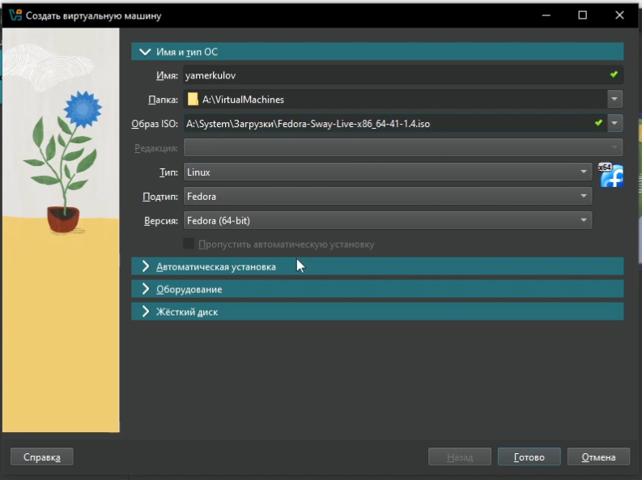
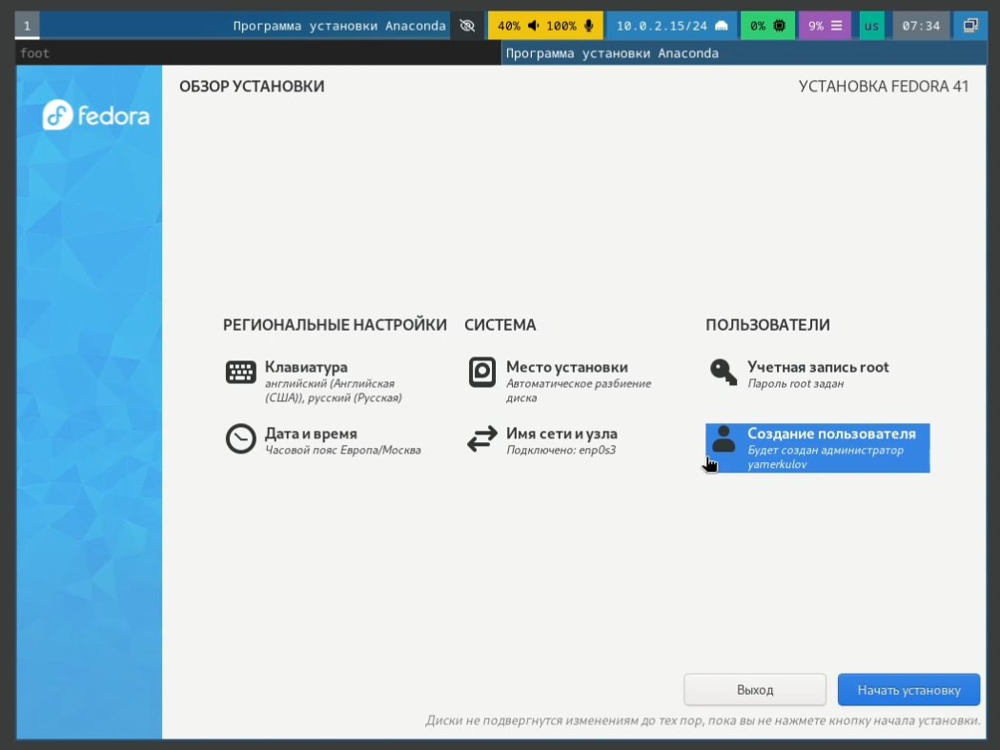
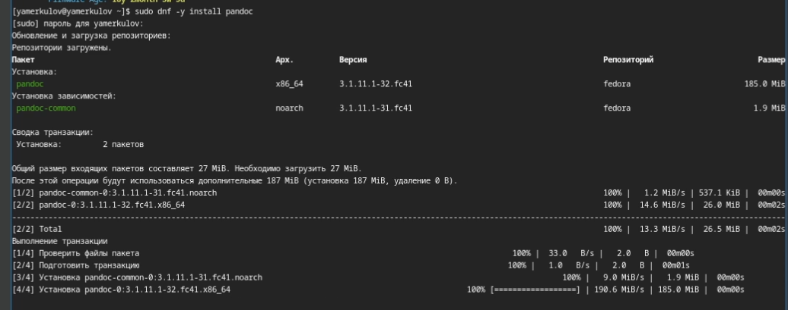

---
## Front matter
lang: ru-RU
title: Лабораторная работа №1
subtitle: Установка и конфигурация операционной системы на виртуальную машину
author:
  - Меркулоя Я. А.
institute:
  - Российский университет дружбы народов, Москва, Россия
date: 2025

## i18n babel
babel-lang: russian
babel-otherlangs: english

## Formatting pdf
toc: false
toc-title: Содержание
slide_level: 2
aspectratio: 169
section-titles: true
theme: metropolis
header-includes:
 - \metroset{progressbar=frametitle,sectionpage=progressbar,numbering=fraction}
---

# Вводная часть

## Цель

- Приобрести практические навыки установки и настройки операционной системы на вирутальную машину

# Выполнение работы

## Создание виртуальной машины

{width=70%}

## Установка системы

- Команда liveinst запускает графический установщик

{width=70%}

## Установка ПО

- Потребовалось установить development-tools, dkms, а также подключить образ дополнений.
- Был установлен pandoc, pandoc-crossref, texlive

{width=70%}

## Домашнее задание

- Были просмотрена информация о:
	- Версии linux
	- Частоте процессора
	- Процессоре
	- Паравиртуализации
	- Файловых системах
	

# Выводы

## Выводы

- Были получены и отработаны практические навыки по установке и настройке
операционной системы на виртуальную машину.

