---
## Front matter
title: "Отчёт по лабораторной работе №1"
subtitle: "Установка и конфигурация операционной системы на виртуальную машину"
author: "Ярослав Антонович Меркулов"

## Generic otions
lang: ru-RU
toc-title: "Содержание"

## Bibliography
bibliography: bib/cite.bib
csl: pandoc/csl/gost-r-7-0-5-2008-numeric.csl

## Pdf output format
toc: true # Table of contents
toc-depth: 2
lof: true # List of figures
fontsize: 12pt
linestretch: 1.5
papersize: a4
documentclass: scrreprt
## I18n polyglossia
polyglossia-lang:
  name: russian
  options:
	- spelling=modern
	- babelshorthands=true
polyglossia-otherlangs:
  name: english
## I18n babel
babel-lang: russian
babel-otherlangs: english
## Fonts
mainfont: IBM Plex Serif
romanfont: IBM Plex Serif
sansfont: IBM Plex Sans
monofont: IBM Plex Mono
mathfont: STIX Two Math
mainfontoptions: Ligatures=Common,Ligatures=TeX,Scale=0.94
romanfontoptions: Ligatures=Common,Ligatures=TeX,Scale=0.94
sansfontoptions: Ligatures=Common,Ligatures=TeX,Scale=MatchLowercase,Scale=0.94
monofontoptions: Scale=MatchLowercase,Scale=0.94,FakeStretch=0.9
mathfontoptions:
## Biblatex
biblatex: true
biblio-style: "gost-numeric"
biblatexoptions:
  - parentracker=true
  - backend=biber
  - hyperref=auto
  - language=auto
  - autolang=other*
  - citestyle=gost-numeric
## Pandoc-crossref LaTeX customization
figureTitle: "Рис."
tableTitle: "Таблица"
listingTitle: "Листинг"
lofTitle: "Список иллюстраций"
lotTitle: "Список таблиц"
lolTitle: "Листинги"
## Misc options
indent: true
header-includes:
  - \usepackage{indentfirst}
  - \usepackage{float} # keep figures where there are in the text
  - \floatplacement{figure}{H} # keep figures where there are in the text
---

# Цель работы

Приобрести практические навыки установки и настройки операционной системы на вирутальную машину.

# Выполнение лабораторной работы

1. Создаём новую виртуальную машину(рис. [-@fig:001]).

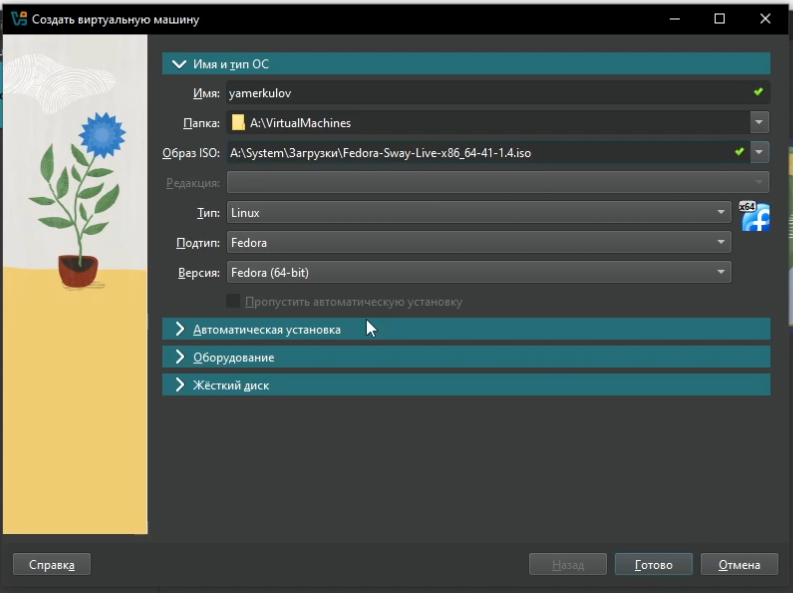{#fig:001 width=70%}

2. Выделяем память и потоки процессора, включаем EFI(рис. [-@fig:002]).

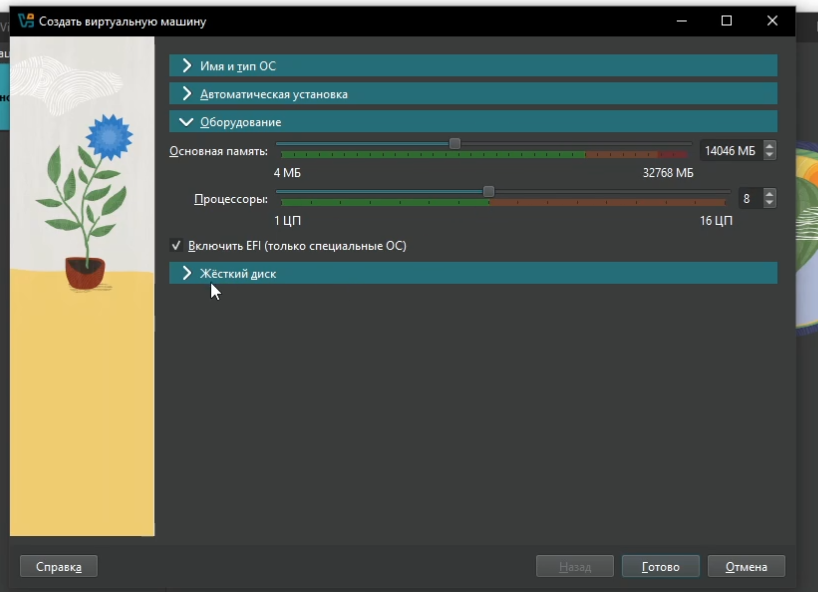{#fig:002 width=70%}

3. Выделяем место (80 гб)(рис. [-@fig:003]).

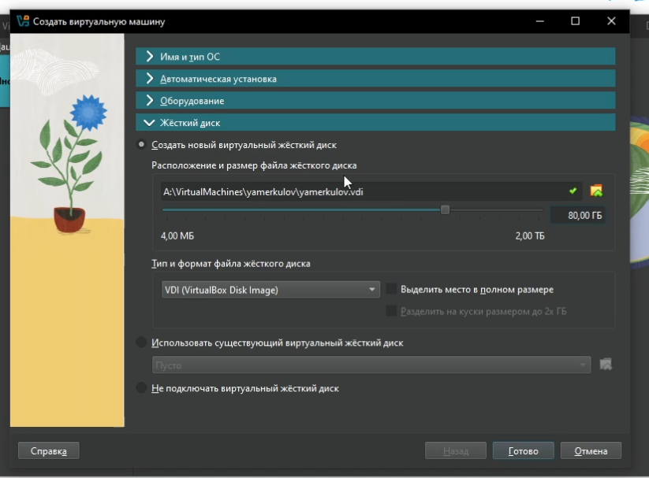{#fig:003 width=70%}

4. Включаем 3d ускорение и выделяем больше видеопамяти(рис. [-@fig:004]).

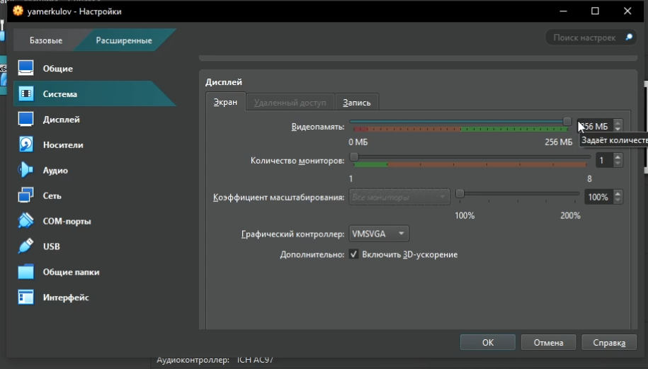{#fig:004 width=70%}

5. Запускаем машину и запускаем установку(рис. [-@fig:005]).

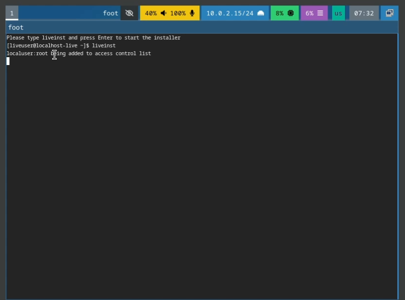{#fig:005 width=70%}

6. Создаём нового пользователя, указываем диск, расскладку, имя хоста(рис. [-@fig:006]).

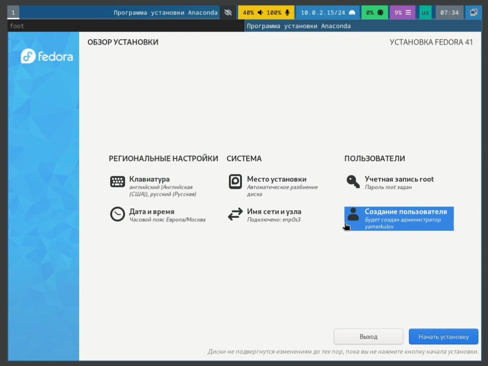{#fig:006 width=70%}

7. Отключаем установочный диск(рис. [-@fig:007]).

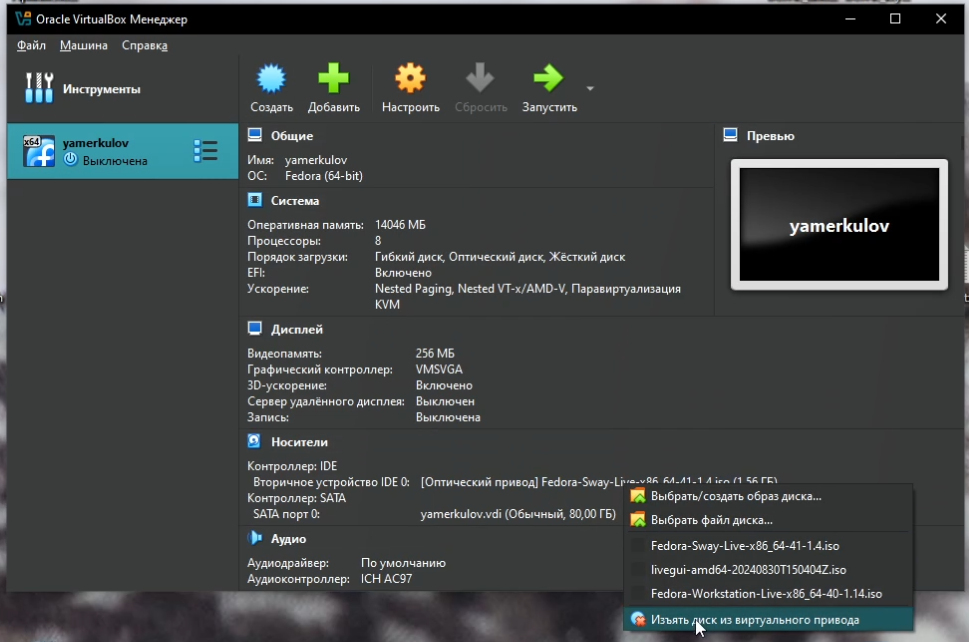{#fig:007 width=70%}

8. Устанавливаем development-tools(рис. [-@fig:008]).

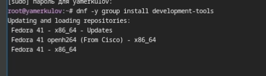{#fig:008 width=70%}

9. Устанавливаем dkms(рис. [-@fig:009]).

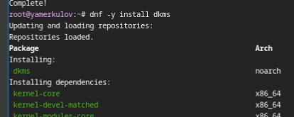{#fig:009 width=70%}

10. Подключаем образ дополнений гостевой ОС(рис. [-@fig:010]).

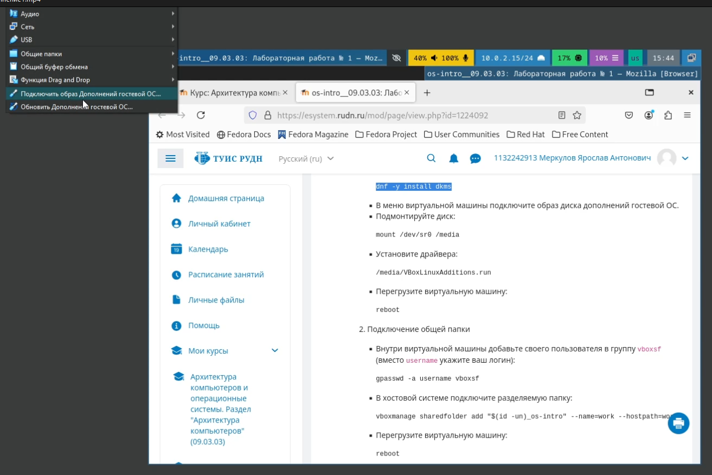{#fig:010 width=70%}

11. Подмонтируем(рис. [-@fig:011]).

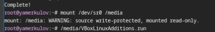{#fig:011 width=70%}

12. Запускаем установку(рис. [-@fig:012]).

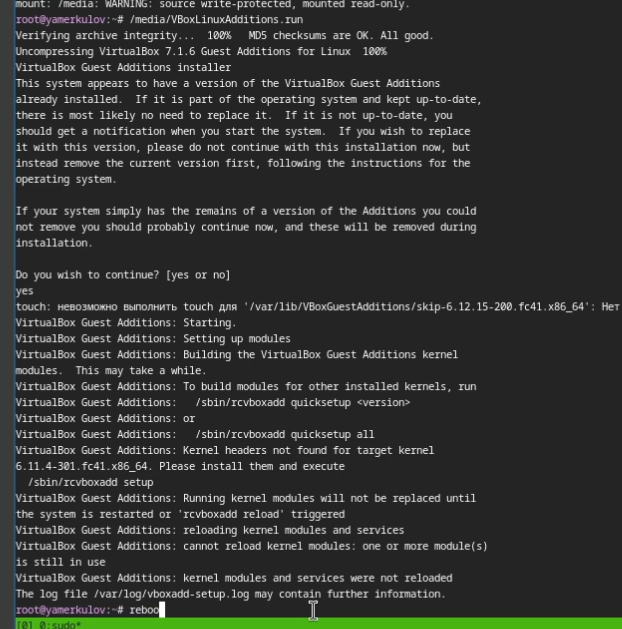{#fig:012 width=70%}

13. Обновляем все пакеты(рис. [-@fig:013]).

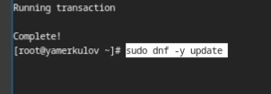{#fig:013 width=70%}

14. Отключаем SELinux(рис. [-@fig:014]).

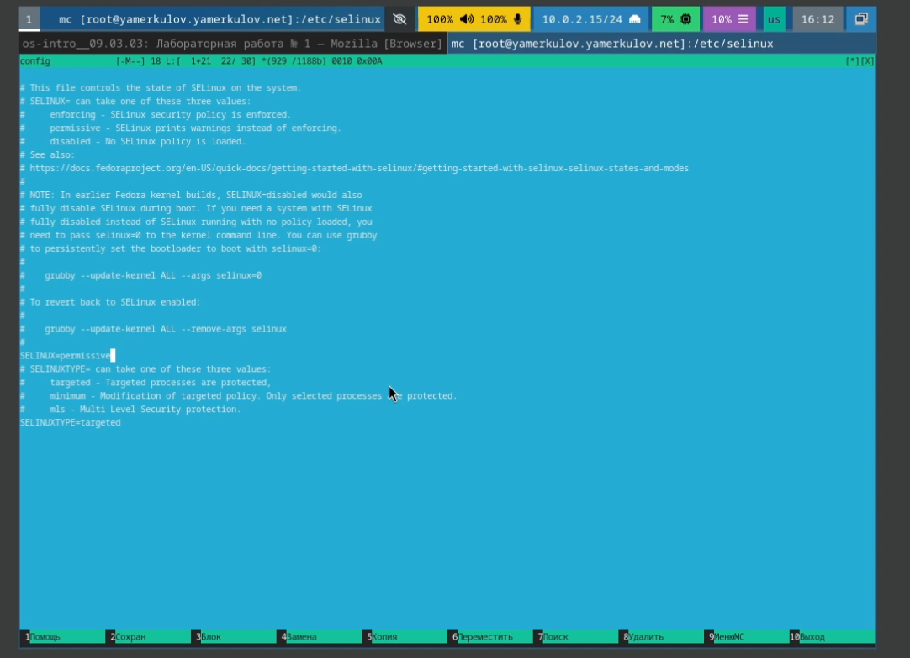{#fig:014 width=70%}

15. Настраиваем расскладку клавиатуры(рис. [-@fig:015]).

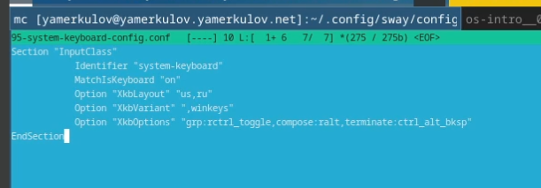{#fig:015 width=70%}

16. Скачиваем pandoc(рис. [-@fig:016]).

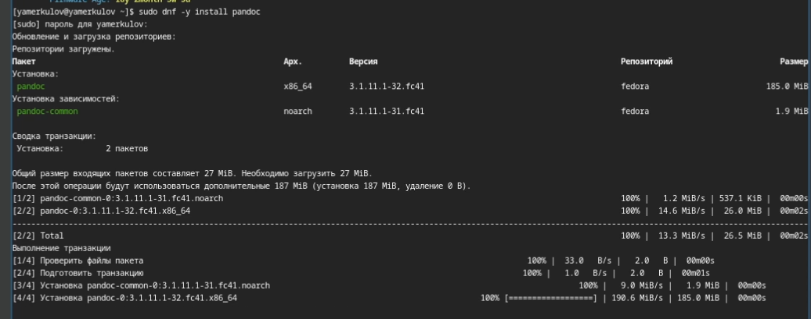{#fig:016 width=70%}

17. Разархивируем pandoc-crossref (предварительно скачаный)(рис. [-@fig:017]).

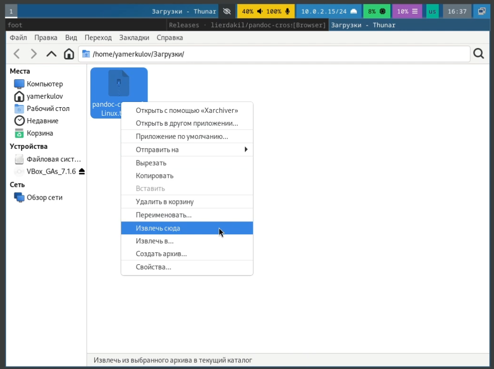{#fig:017 width=70%}

18. Переносим файл в /usr/local/bin/(рис. [-@fig:018]).

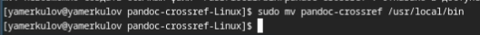{#fig:018 width=70%}

19. Устанавливаем texlive(рис. [-@fig:019]).

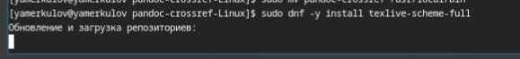{#fig:019 width=70%}

# Домашнее задание

20. Просматриваем версию linux(рис. [-@fig:020]).

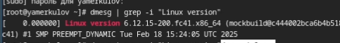{#fig:020 width=70%}

21. Частота процессора(рис. [-@fig:021]).

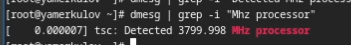{#fig:021 width=70%}

22. Модель процессора(рис. [-@fig:022]).

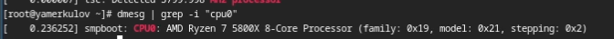{#fig:022 width=70%}

23. Выделенная память(рис. [-@fig:023]).

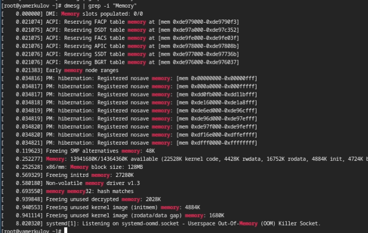{#fig:023 width=70%}

24. Паравиртуализация и файловые системы(рис. [-@fig:024]).

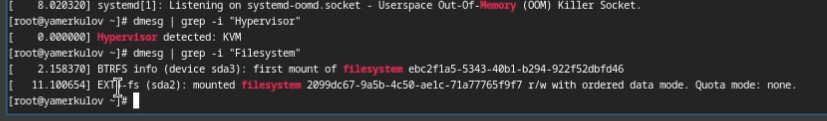{#fig:024 width=70%}

# Ответы на контрольные вопросы

1. Какую информацию содержит учётная запись пользователя?

Учётная запись пользователя содержит информацию, необходимую для идентификации и авторизации пользователя, такую как логин, пароль, группа, путь домашнего каталога.

2. Консольные команды:

Справка -- help (help pwd)

Перемещение -- cd (cd /)

Просмотр содержимого каталога -- ls (ls /)

Создание каталогов -- mkdir (mkdir ~/aaaa)

Удаление -- rm (rm ~/text.txt)

Управление правами -- chmod (chmod 755 test.txt)

История команд -- history

3. Файловая система -- способ организации хранения данных.

Примеры:

Файловая система Linux -- EXT4

Windows -- NTFS

4. Как посмотреть, какие файловые системы подмонтированы в ОС?

С помощью grep

5. Как удалить зависший процесс?

Команда kill

# Выводы

Были получены и отработаны практические навыки по установке и настройке операционной системы на виртуальную машину

