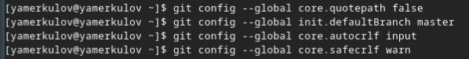
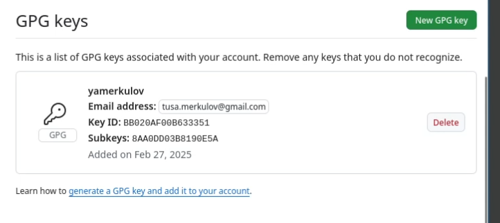
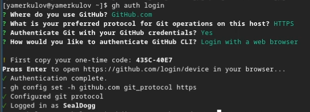
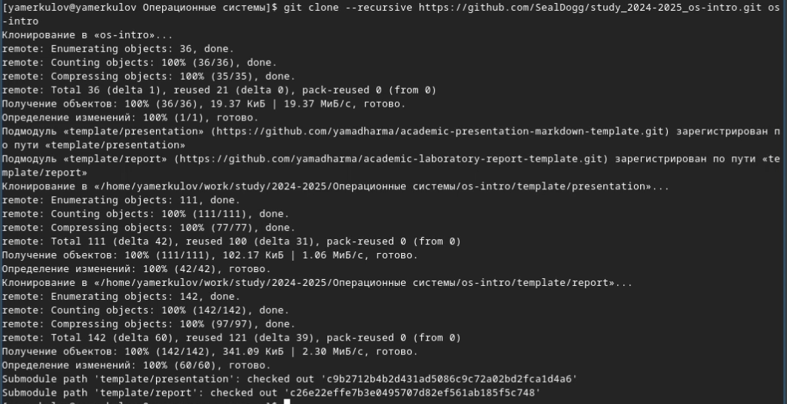

---
## Front matter
lang: ru-RU
title: Лабораторная работа №2
subtitle: Первоначальна настройка git
author:
  - Меркулоя Я. А.
institute:
  - Российский университет дружбы народов, Москва, Россия
date: 2025

## i18n babel
babel-lang: russian
babel-otherlangs: english

## Formatting pdf
toc: false
toc-title: Содержание
slide_level: 2
aspectratio: 169
section-titles: true
theme: metropolis
header-includes:
 - \metroset{progressbar=frametitle,sectionpage=progressbar,numbering=fraction}
---

# Вводная часть

## Цель

- Получить навыки работы с системой контроля версий git

# Выполнение работы

## Базовая настройка git

- После установки git требуется настройка:
	- почты и имени
	- параметров autocrif, safecrif, utf8
	- имени начальной ветки

{width=70%}

## Ключи

- В процессе установки были сгенерированы 3 вида ключей:
	- rsa
	- ed25519
	- gpg
- Использовать для github мы будем ключ gpg.

{width=70%}

## Gh

- Была использованна утилита gh для работы с git
- Вход осуществляется через браузер

{width=70%}

## Работа с репозиторием

- Репозиторий был склонирован с шаблона при помощт git clone

{width=70%}

## Работа с репозиторием

- Были удалены лишние файлы
- Созданы новые каталоги
- Данные отправлены на сервер
	

# Выводы

## Выводы

- Были получены и отработаны практические навыки по работе с git.

