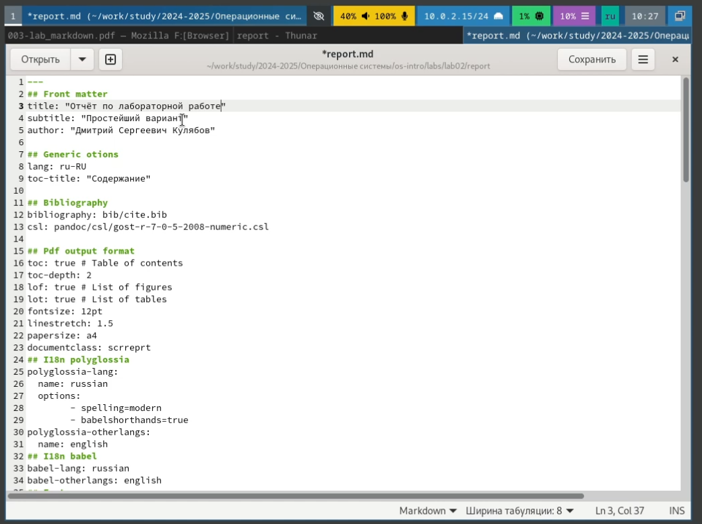
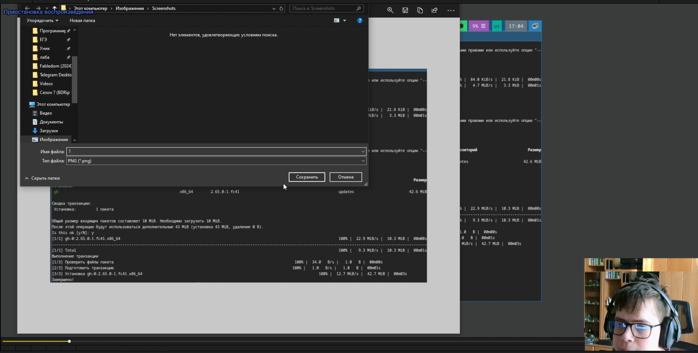
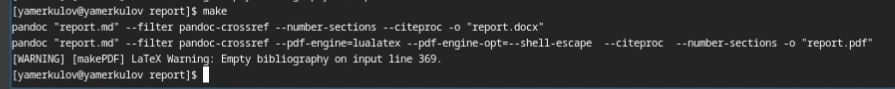
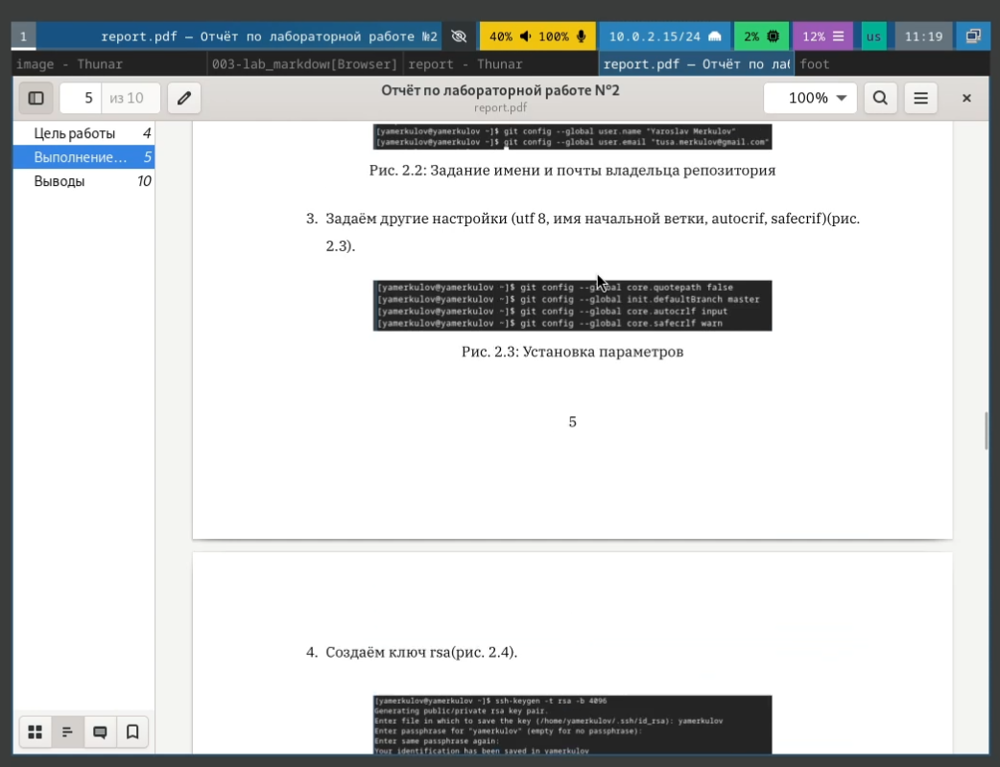

---
## Front matter
lang: ru-RU
title: Лабораторная работа №3
subtitle: Markdown
author:
  - Меркулоя Я. А.
institute:
  - Российский университет дружбы народов, Москва, Россия
date: 2025

## i18n babel
babel-lang: russian
babel-otherlangs: english

## Formatting pdf
toc: false
toc-title: Содержание
slide_level: 2
aspectratio: 169
section-titles: true
theme: metropolis
header-includes:
 - \metroset{progressbar=frametitle,sectionpage=progressbar,numbering=fraction}
---

# Вводная часть

## Цель

- Научиться оформлять отчёты с помощью легковесного языка разметки Markdown.

# Выполнение работы

## Markdown

Используем редактор gedit для редактирования файлов .md

{width=70%}

## Скриншоты

Вырезаем скриншоты с записанного видео выполнения работы

{width=70%}

## Make

Преобразуем файл markdown в pdf и docx с помощью команды make

{width=70%}

## Готовый файл
	
В результате получились файлы двух форматов PDF и DOCX.

{width=70%}	

# Выводы

## Выводы

Были получены и отработаны практические навыки по работе с языком разметки Markdown

