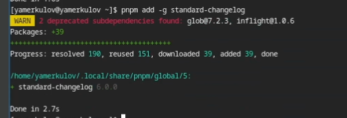
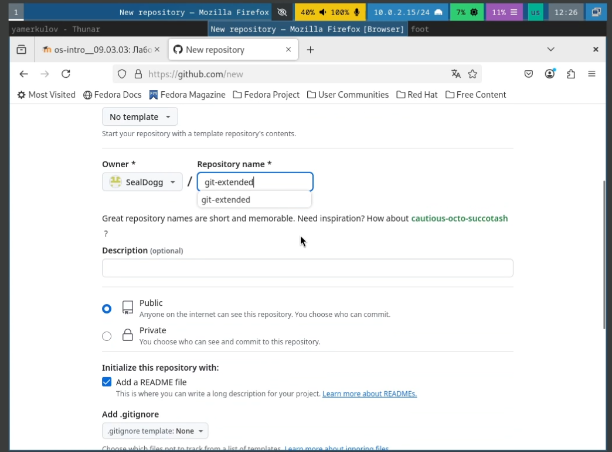
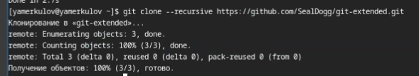
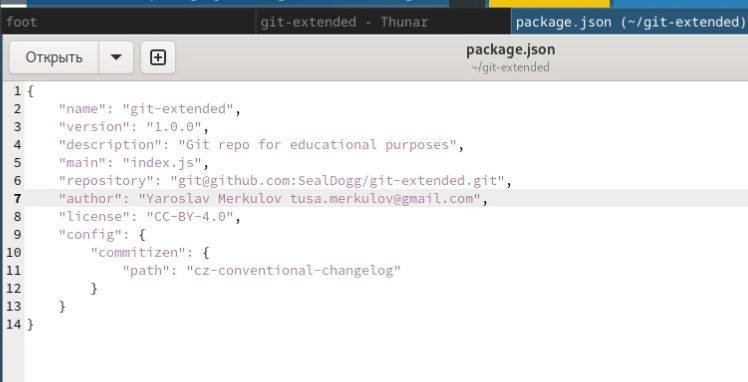
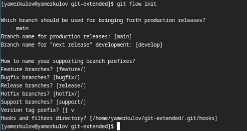
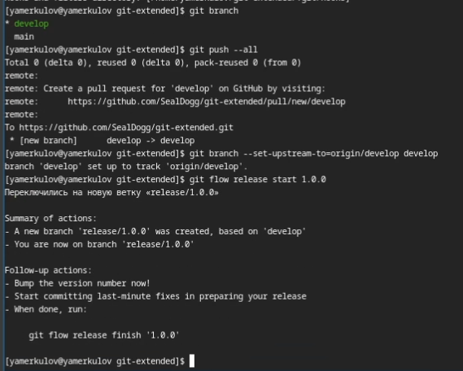

---
## Front matter
lang: ru-RU
title: Лабораторная работа №4
subtitle: Продвинутое использование git
author:
  - Меркулоя Я. А.
institute:
  - Российский университет дружбы народов, Москва, Россия
date: 2025

## i18n babel
babel-lang: russian
babel-otherlangs: english

## Formatting pdf
toc: false
toc-title: Содержание
slide_level: 2
aspectratio: 169
section-titles: true
theme: metropolis
header-includes:
 - \metroset{progressbar=frametitle,sectionpage=progressbar,numbering=fraction}
---

# Вводная часть

## Цель

- Научиться правильно работать с git flow

# Выполнение работы

## Установка ПО

- Были установлены следующие программы:

	- gitflow
	
	- nodeJS
	
	- pnpm

## Установка ПО

- Через pnpm были установлены:

	- commitizen
	
	- standard-changelog

{width=70%}

## Создание нового репозитория

- Репозиторий был создан через сайт GitHub

{width=70%}

## Работа с репозиторием

- Репозиторий был склонирован с сервера GitHub командой clone

{width=70%}

- После добавления коммита, всё было загружено обратно на сервер

## Конфигурация NodeJS

- В файле конфигурации:
	
	- Вписываем свою фамилию и имя, а также почту
	
	- Лицензию
	
	- Формат коммитов
	
	- Ссылку на репозиторий
	
{width=70%}

## Настройка git flow

- Утилита сама предлагает выбрать настройки, всё выставляем по умолчанию кроме префикса, у нас он будет v

{width=70%}
	
## Создание релизов

- Создаём новый релиз и добавляем туда changelog

{width=70%}

## Создание релизов

- Аналогично будет создан ещё один релиз 1.2.3
- После второго релиза будет изменена версия в файле конфигурации json
- Все релизы будут загружены на сервер

# Выводы

## Выводы

- Были получены и отработаны практические навыки по работа с git flow

