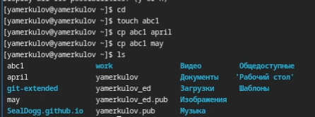
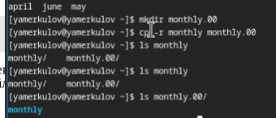
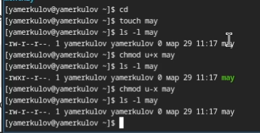
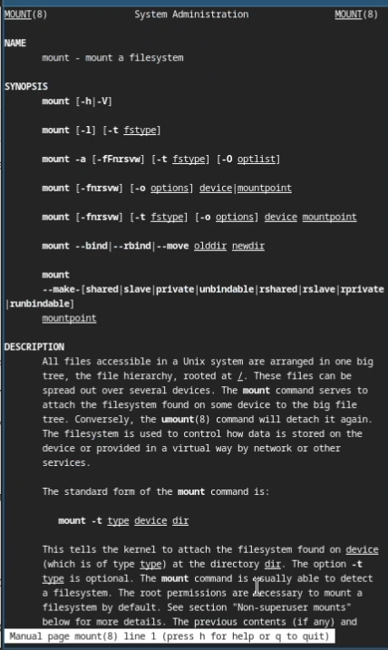

---
## Front matter
lang: ru-RU
title: Лабораторная работа №7
subtitle: Анализ файловой системы Linux. Команды для работы с файлами и каталогами
author:
  - Меркулоя Я. А.
institute:
  - Российский университет дружбы народов, Москва, Россия
date: 2025

## i18n babel
babel-lang: russian
babel-otherlangs: english

## Formatting pdf
toc: false
toc-title: Содержание
slide_level: 2
aspectratio: 169
section-titles: true
theme: metropolis
header-includes:
 - \metroset{progressbar=frametitle,sectionpage=progressbar,numbering=fraction}
---

# Вводная часть

## Цель

- Ознакомиться с файловой системой Linux, её структурой. Приобрести практические навыки по работе с файлами и каталогами.

# Выполнение работы

## Работа с файлами
{width=70%}

## Работа с каталогами

{width=70%}

## Работа с правами дотсупа

- Для работы с правами доступа используется команда chmod

{width=70%}

## Справка man

- С помощью команды man можно получить документацию по нужной команде

{width=70%}

# Выводы

## Выводы

- Были получены и отработаны практические навыки по работе с файлами, ка-
талогами, правами доступа.

