---
## Front matter
title: "Отчёт по лабораторной работе №7"
subtitle: "Анализ файловой структуры UNIX. Команды для работы с файлами и каталогами"
author: "Ярослав Антонович Меркулов"

## Generic otions
lang: ru-RU
toc-title: "Содержание"

## Bibliography
bibliography: bib/cite.bib
csl: pandoc/csl/gost-r-7-0-5-2008-numeric.csl

## Pdf output format
toc: true # Table of contents
toc-depth: 2
lof: true # List of figures
fontsize: 12pt
linestretch: 1.5
papersize: a4
documentclass: scrreprt
## I18n polyglossia
polyglossia-lang:
  name: russian
  options:
	- spelling=modern
	- babelshorthands=true
polyglossia-otherlangs:
  name: english
## I18n babel
babel-lang: russian
babel-otherlangs: english
## Fonts
mainfont: IBM Plex Serif
romanfont: IBM Plex Serif
sansfont: IBM Plex Sans
monofont: IBM Plex Mono
mathfont: STIX Two Math
mainfontoptions: Ligatures=Common,Ligatures=TeX,Scale=0.94
romanfontoptions: Ligatures=Common,Ligatures=TeX,Scale=0.94
sansfontoptions: Ligatures=Common,Ligatures=TeX,Scale=MatchLowercase,Scale=0.94
monofontoptions: Scale=MatchLowercase,Scale=0.94,FakeStretch=0.9
mathfontoptions:
## Biblatex
biblatex: true
biblio-style: "gost-numeric"
biblatexoptions:
  - parentracker=true
  - backend=biber
  - hyperref=auto
  - language=auto
  - autolang=other*
  - citestyle=gost-numeric
## Pandoc-crossref LaTeX customization
figureTitle: "Рис."
tableTitle: "Таблица"
listingTitle: "Листинг"
lofTitle: "Список иллюстраций"
lotTitle: "Список таблиц"
lolTitle: "Листинги"
## Misc options
indent: true
header-includes:
  - \usepackage{indentfirst}
  - \usepackage{float} # keep figures where there are in the text
  - \floatplacement{figure}{H} # keep figures where there are in the text
---

# Цель работы

Ознакомиться с файловой системой Linux, её структурой. Приобрести практические навыки по работе с файлами и каталогами.

# Выполнение лабораторной работы

1. Создаём файл abc1, копируем его с другими названиями(рис. [-@fig:001]).

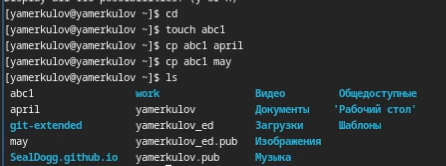{#fig:001 width=70%}

2. Создаём новый каталог, копируем туда файлы(рис. [-@fig:002]).

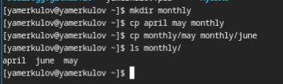{#fig:002 width=70%}

3. Рекурсивно копируем каталог(рис. [-@fig:003]).

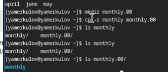{#fig:003 width=70%}

4. Снова копируем каталог в /tmp(рис. [-@fig:004]).

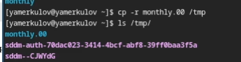{#fig:004 width=70%}

5. Переименовываем файл с помощью mv(рис. [-@fig:005]).

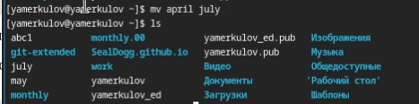{#fig:005 width=70%}

6. Переименовываем каталог(рис. [-@fig:006]).

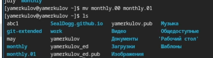{#fig:006 width=70%}

7. Снова создаём каталог и переносим старый каталог в новый(рис. [-@fig:007]).

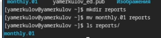{#fig:007 width=70%}

8. Переименовываем каталог внутри каталога(рис. [-@fig:008]).

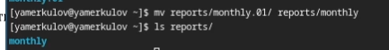{#fig:008 width=70%}

9. Создаём новые файлы, меняем их права с помощью chmod(рис. [-@fig:009]).

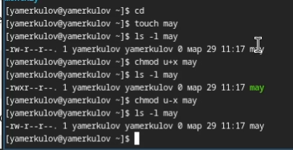{#fig:009 width=70%}

10. Меняем права доступа у каталога(рис. [-@fig:010]).

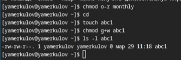{#fig:010 width=70%}

11. Копируем файл в домашний каталог с изменением его имени(рис. [-@fig:011]).

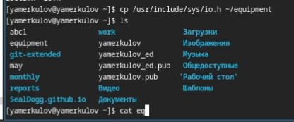{#fig:011 width=70%}

12. Работаем с новым каталогом(рис. [-@fig:012]).

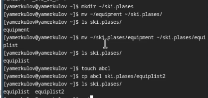{#fig:012 width=70%}

13. Создаём новые файлы и каталоги, перемщаем и копируем в соответствии с заданием(рис. [-@fig:013]).

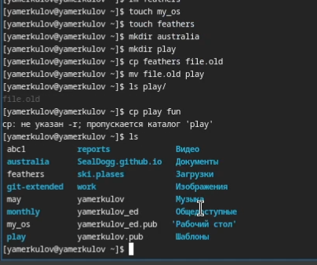{#fig:013 width=70%}

14. Меняем права доступа у файлов и каталогов, проверяем работоспособность копирования и перехода в каталог(рис. [-@fig:014]).

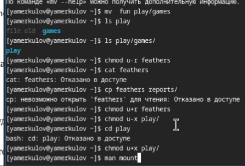{#fig:014 width=70%}

15. Справка по mount (аналогично можно посмотреть и другие команды)(рис. [-@fig:015]).

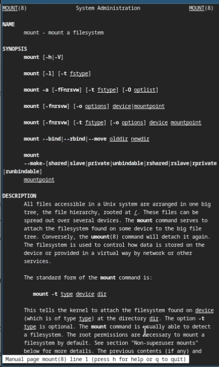{#fig:015 width=70%}

# Ответы на контрольные вопросы

1. Дайте характеристику каждой файловой системе, существующей на жёстком диске
компьютера, на котором вы выполняли лабораторную работу.

/dev/sda3 on / type btrfs (rw,relatime,seclabel,compress=zstd:1,space_cache=v2,subvolid=257,subvol=/root)
/dev/sda3 on /home type btrfs (rw,relatime,seclabel,compress=zstd:1,space_cache=v2,subvolid=256,subvol=/home)
/dev/sda2 on /boot type ext4 (rw,relatime,seclabel)
/dev/sda1 on /boot/efi type vfat (rw,relatime,fmask=0077,dmask=0077,codepage=437,iocharset=ascii,shortname=winnt,errors=remount-ro)
/dev/sr0 on /run/media/yamerkulov/VBox_GAs_7.1.6 type iso9660 (ro,nosuid,nodev,relatime,nojoliet,check=s,map=n,blocksize=2048,uid=1000,gid=1000,dmode=500,fmode=400,iocharset=utf8,uhelper=udisks2)

2. Структура файловой системы

    / — root каталог. Содержит в себе всю иерархию системы;
    /bin — здесь находятся двоичные исполняемые файлы. Основные общие команды, хранящиеся отдельно от других программ в системе (прим.: pwd, ls, cat, ps);
    /boot — тут расположены файлы, используемые для загрузки системы (образ initrd, ядро vmlinuz);
    /dev — в данной директории располагаются файлы устройств (драйверов). С помощью этих файлов можно взаимодействовать с устройствами. К примеру, если это жесткий диск, можно подключить его к файловой системе. В файл принтера же можно написать напрямую и отправить задание на печать;
    /etc — в этой директории находятся файлы конфигураций программ. Эти файлы позволяют настраивать системы, сервисы, скрипты системных демонов;
    /home — каталог, аналогичный каталогу Users в Windows. Содержит домашние каталоги учетных записей пользователей (кроме root). При создании нового пользователя здесь создается одноименный каталог с аналогичным именем и хранит личные файлы этого пользователя;
    /lib — содержит системные библиотеки, с которыми работают программы и модули ядра;
    /lost+found — содержит файлы, восстановленные после сбоя работы системы. Система проведет проверку после сбоя и найденные файлы можно будет посмотреть в данном каталоге;
    /media — точка монтирования внешних носителей. Например, когда вы вставляете диск в дисковод, он будет автоматически смонтирован в директорию /media/cdrom;
    /mnt — точка временного монтирования. Файловые системы подключаемых устройств обычно монтируются в этот каталог для временного использования;
    /opt — тут расположены дополнительные (необязательные) приложения. Такие программы обычно не подчиняются принятой иерархии и хранят свои файлы в одном подкаталоге (бинарные, библиотеки, конфигурации);
    /proc — содержит файлы, хранящие информацию о запущенных процессах и о состоянии ядра ОС;
    /root — директория, которая содержит файлы и личные настройки суперпользователя;
    /run — содержит файлы состояния приложений. Например, PID-файлы или UNIX-сокеты;
    /sbin — аналогично /bin содержит бинарные файлы. Утилиты нужны для настройки и администрирования системы суперпользователем;
    /srv — содержит файлы сервисов, предоставляемых сервером (прим. FTP или Apache HTTP);
    /sys — содержит данные непосредственно о системе. Тут можно узнать информацию о ядре, драйверах и устройствах;
    /tmp — содержит временные файлы. Данные файлы доступны всем пользователям на чтение и запись. Стоит отметить, что данный каталог очищается при перезагрузке;
    /usr — содержит пользовательские приложения и утилиты второго уровня, используемые пользователями, а не системой. Содержимое доступно только для чтения (кроме root). Каталог имеет вторичную иерархию и похож на корневой;
    /var — содержит переменные файлы. Имеет подкаталоги, отвечающие за отдельные переменные. Например, логи будут храниться в /var/log, кэш в /var/cache, очереди заданий в /var/spool/ и так далее.

3. Какая операция должна быть выполнена, чтобы содержимое некоторой файловой
системы было доступно операционной системе?

Команда mount

4. Назовите основные причины нарушения целостности файловой системы. Как устра-
нить повреждения файловой системы?

 Ошибки файловой системы обычно возникают из-за следующих проблем, связанных с дисками:

    Плохие секторы
    Неправильная установка диска
    Несовместимые диски
    Проблема с оборудованием

Исправить ошибки можно с помощью команды fsck

5. Как создаётся файловая система?

Для создания файловой системы на логическом томе можно воспользоваться командой mkfs 

6. Дайте характеристику командам для просмотра текстовых файлов.

Распространенные команды для вывода содержимого файлов:

    cat: отображает содержимое файла.
    tac: делает то же самое, что и cat, но отображает содержимое в обратном порядке.
    tail: показывает только последние строки текстового файла.
    head: отображает первые строки файла.

7. Приведите основные возможности команды cp в Linux.

cp — команда, предназначенная для копирования файлов из одного в другие каталоги (возможно, с другой файловой системой). Исходный файл остаётся неизменным, имя созданного файла может быть таким же, как у исходного, или изменится.

 Опции команды:

    -R, -r, --recursive (recursive) — копировать директории рекурсивно (то есть все поддиректории и все файлы в поддиректориях).

    -f (force) — разрешает удаление целевого файла, в который производится копирование, если он не может быть открыт для записи.

    -H — используйте этот ключ, чтобы копировать символические ссылки. По умолчанию команда переходит по символическим ссылкам и копирует файлы, на которые те указывают.

    -i (interactive) — команда будет запрашивать, следует ли перезаписывать конечный файл, имя которого совпадает с именем исходного, то есть если в параметре целевой_каталог или целевой_файл встречается такое же имя файла, какое было задано в параметре исходный_файл или исходная_директория, то запрашивается подтверждение. Для того, чтобы перезаписать файл, следует ввести y или его эквивалент для данной локали. Ввод любого другого символа приведёт к отмене перезаписи данного файла.

    -n, --no-clobber — не перезаписывать существующий файл (отменяет предыдущий параметр -i).

    -v, --verbose — выводит имя каждого файла перед его копированием.

8. Приведите основные возможности команды mv в Li

Команда mv может:

    Переместить один или несколько файлов в другую директорию.
    Переместить одну или несколько директорий в другую директорию.
    Переименовать файл.
    Переименовать директорию.
    
9. Что такое права доступа? Как они могут быть изменены?

Права доступа к файлам и каталогам Linux бывают трех типов: 

    r — читать (read) — дает возможность просматривать файлы или каталоги;

    w — записывать (write) — разрешает создавать, удалять и изменять их;

    x — выполнять (execute) — позволяет входить в каталоги или выполнять файлы.

Все вышеуказанные типы доступа могут быть назначены основным видам пользователей системы. Их тоже три: 

    владельцы файла или каталога;

    группы пользователей, обладающие правами на файл или каталог;

    другие юзеры.
    
Изменить их можно с помощью команды chmod

# Выводы

Были получены и отработаны практические навыки по работе с файлами, каталогами, правами доступа.
