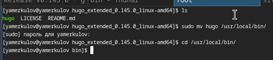
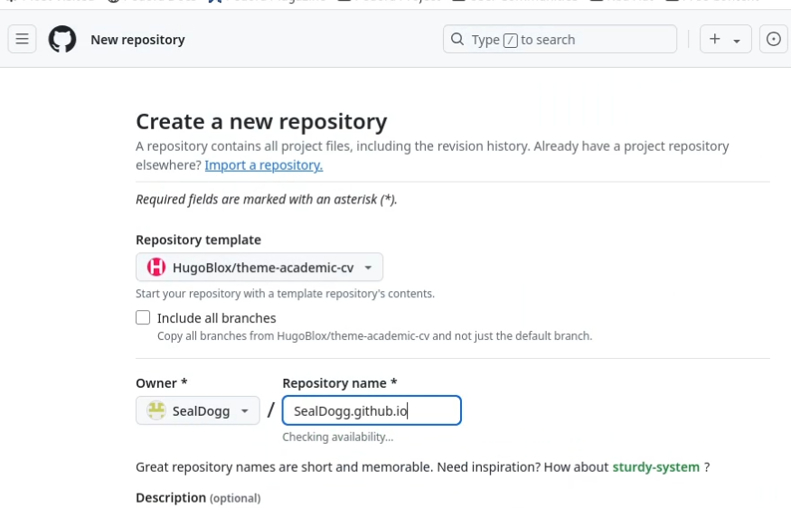
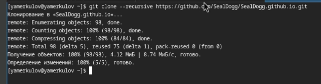
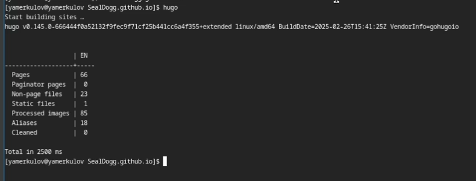
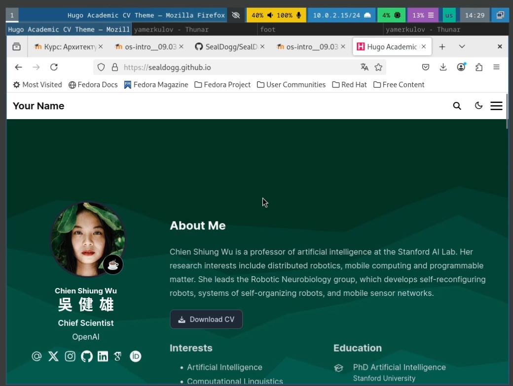

---
## Front matter
lang: ru-RU
title: Индивидуальный проект
subtitle: Этап 1
author:
  - Меркулоя Я. А.
institute:
  - Российский университет дружбы народов, Москва, Россия
date: 2025

## i18n babel
babel-lang: russian
babel-otherlangs: english

## Formatting pdf
toc: false
toc-title: Содержание
slide_level: 2
aspectratio: 169
section-titles: true
theme: metropolis
header-includes:
 - \metroset{progressbar=frametitle,sectionpage=progressbar,numbering=fraction}
---

# Вводная часть

## Цель

- Разместить на github pages заготовку для персонального сайта.

# Выполнение

## Установка hugo

{width=70%}

## Копирование репозитория с шаблона

{width=70%}

## Клонирование репозитория

- Для работы с репозиторием, требуется его клонирование

{width=70%}

## Создание сайта

{width=70%}
	
## Готовый сайт

{width=70%}

# Выводы

## Выводы

- Заготовка персонального сайта была выложена на git hub. 
- Использовалась утилита hugo.

