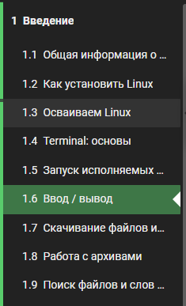
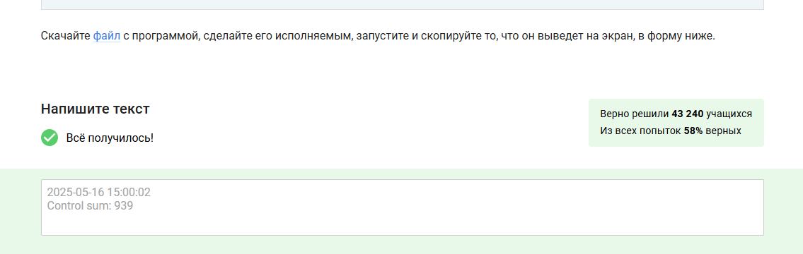
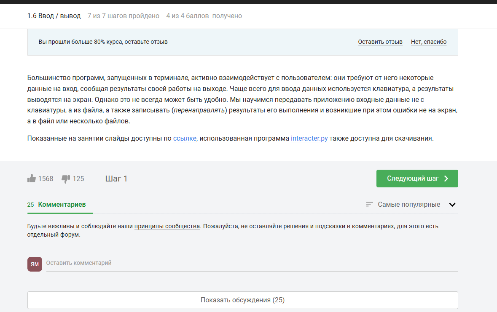
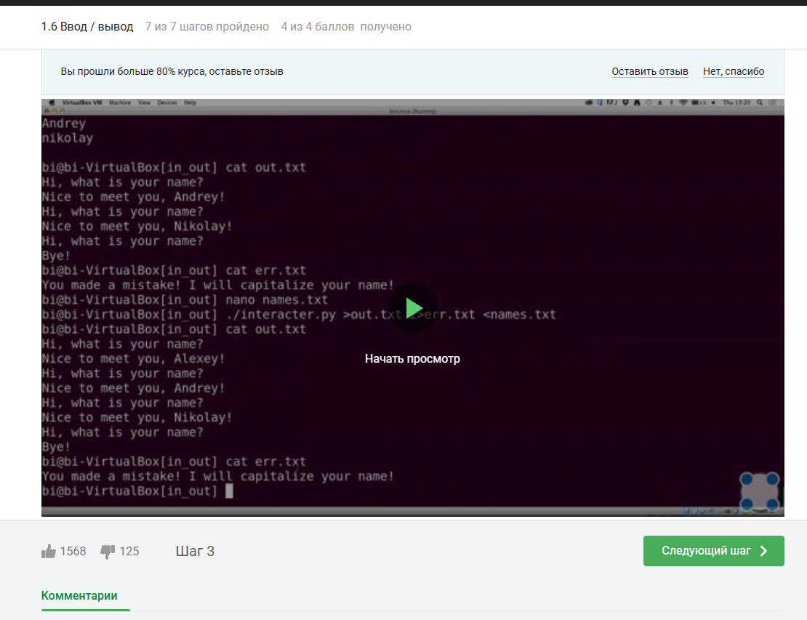

---
## Front matter
lang: ru-RU
title: Прохождение внешнего курса
subtitle: Этап 1
author:
  - Меркулоя Я. А.
institute:
  - Российский университет дружбы народов, Москва, Россия
date: 2025

## i18n babel
babel-lang: russian
babel-otherlangs: english

## Formatting pdf
toc: false
toc-title: Содержание
slide_level: 2
aspectratio: 169
section-titles: true
theme: metropolis
header-includes:
 - \metroset{progressbar=frametitle,sectionpage=progressbar,numbering=fraction}
---

# Вводная часть

## Цель

- Пройти первый этап внешнего курса “Введение в Linux”.

# Выполнение работы

## Разделы

{width=70%}

## Виды работ

{width=70%}

## Виды работ

{width=70%}

## Виды работ

{width=70%}

## Отзыв

- Информация воспринимается легко, короткие ролики смотрятся на одном дыхании
- В целом, вся информация полезна
- Нет лишней информации
- Были как теоретические, так и практические вопросы (задания)
	
# Выводы

## Выводы

Были получены знания о Линуксе: терминале, командам, их работе, архивато-
рам. Были выполнены тесты.

