---
## Front matter
title: "Отчёт по прохождению внешнего курса"
subtitle: "1 этап"
author: "Ярослав Антонович Меркулов"

## Generic otions
lang: ru-RU
toc-title: "Содержание"

## Bibliography
bibliography: bib/cite.bib
csl: pandoc/csl/gost-r-7-0-5-2008-numeric.csl

## Pdf output format
toc: true # Table of contents
toc-depth: 2
lof: true # List of figures
fontsize: 12pt
linestretch: 1.5
papersize: a4
documentclass: scrreprt
## I18n polyglossia
polyglossia-lang:
  name: russian
  options:
	- spelling=modern
	- babelshorthands=true
polyglossia-otherlangs:
  name: english
## I18n babel
babel-lang: russian
babel-otherlangs: english
## Fonts
mainfont: IBM Plex Serif
romanfont: IBM Plex Serif
sansfont: IBM Plex Sans
monofont: IBM Plex Mono
mathfont: STIX Two Math
mainfontoptions: Ligatures=Common,Ligatures=TeX,Scale=0.94
romanfontoptions: Ligatures=Common,Ligatures=TeX,Scale=0.94
sansfontoptions: Ligatures=Common,Ligatures=TeX,Scale=MatchLowercase,Scale=0.94
monofontoptions: Scale=MatchLowercase,Scale=0.94,FakeStretch=0.9
mathfontoptions:
## Biblatex
biblatex: true
biblio-style: "gost-numeric"
biblatexoptions:
  - parentracker=true
  - backend=biber
  - hyperref=auto
  - language=auto
  - autolang=other*
  - citestyle=gost-numeric
## Pandoc-crossref LaTeX customization
figureTitle: "Рис."
tableTitle: "Таблица"
listingTitle: "Листинг"
lofTitle: "Список иллюстраций"
lotTitle: "Список таблиц"
lolTitle: "Листинги"
## Misc options
indent: true
header-includes:
  - \usepackage{indentfirst}
  - \usepackage{float} # keep figures where there are in the text
  - \floatplacement{figure}{H} # keep figures where there are in the text
---

# Цель работы

Пройти первый этап внешнего курса "Введение в Linux".

# Выполнение этапа

1. Вводный вопрос с очевидным ответом (рис. [-@fig:001]).

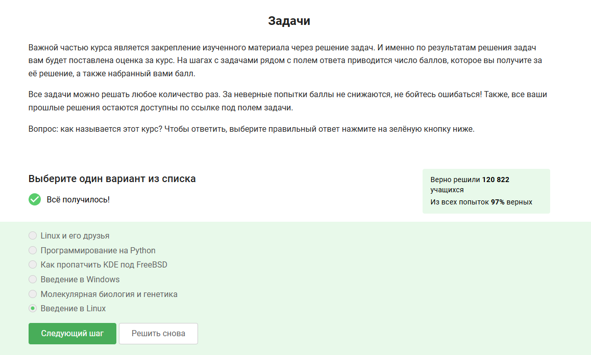{#fig:001 width=70%}

2. Тут тоже всё понятно, дедлайнов нет, буду работать честно и т.д.(рис. [-@fig:002]).

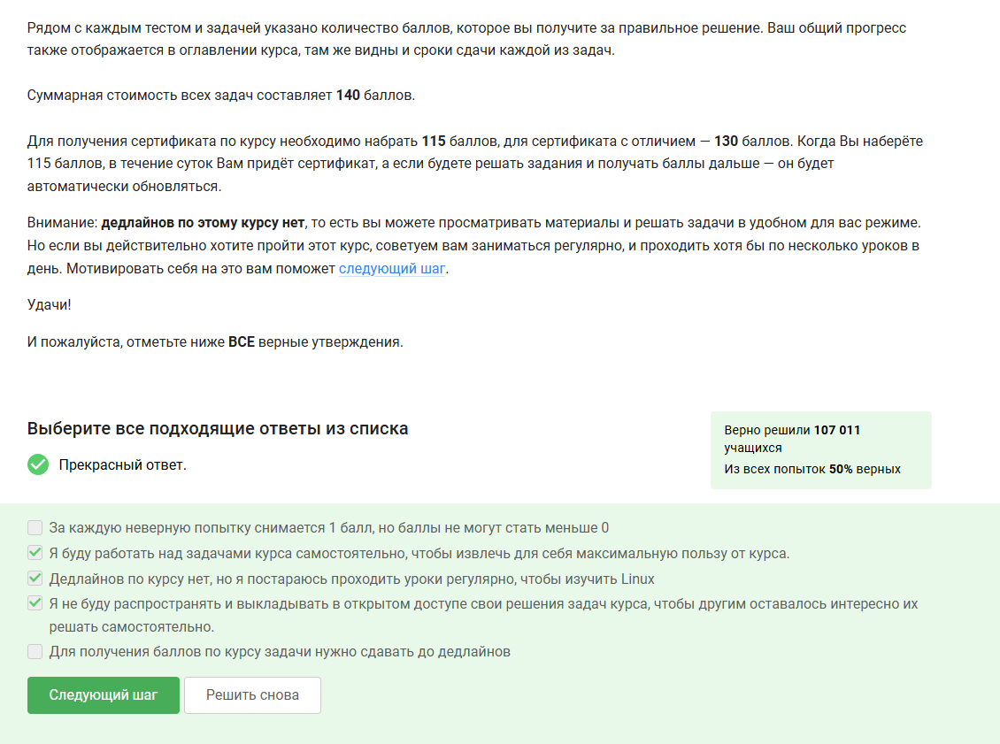{#fig:002 width=70%}

3. Вопрос для статистики. Можно выбрать всё что угодно(рис. [-@fig:003]).

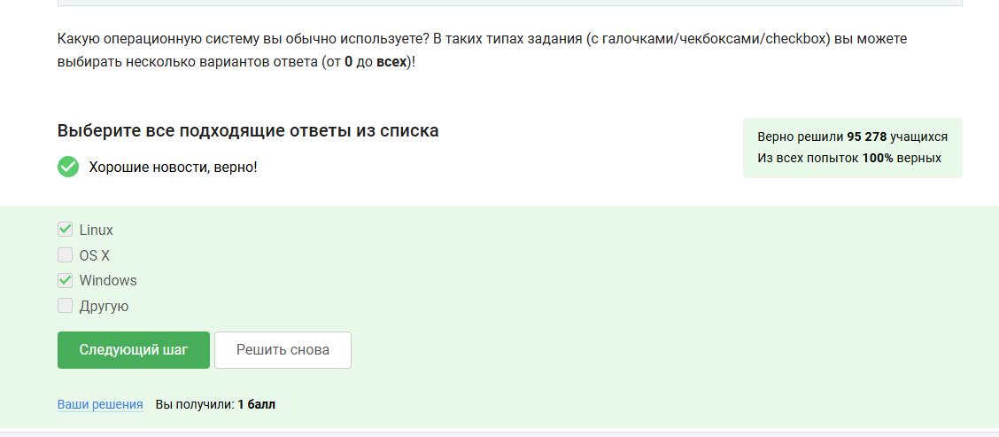{#fig:003 width=70%}

4. Виртуальная машина это программа для запуска одной ОС внутри другой ОС. Все остальные ответы глупые (рис. [-@fig:004]).

{#fig:004 width=70%}

5. Без комментариев.(рис. [-@fig:005]).

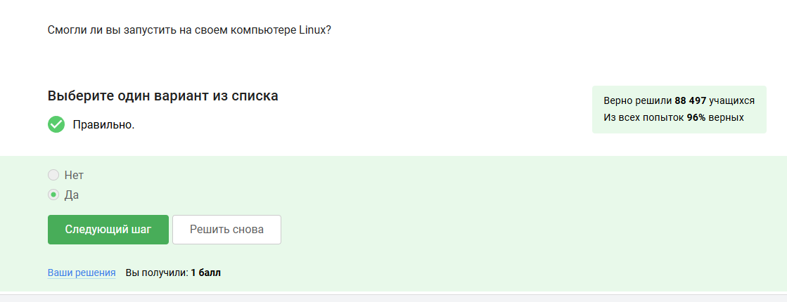{#fig:005 width=70%}

6. Ответ deb. Есть ещё exe - установочные пакеты в windows.(рис. [-@fig:006]).

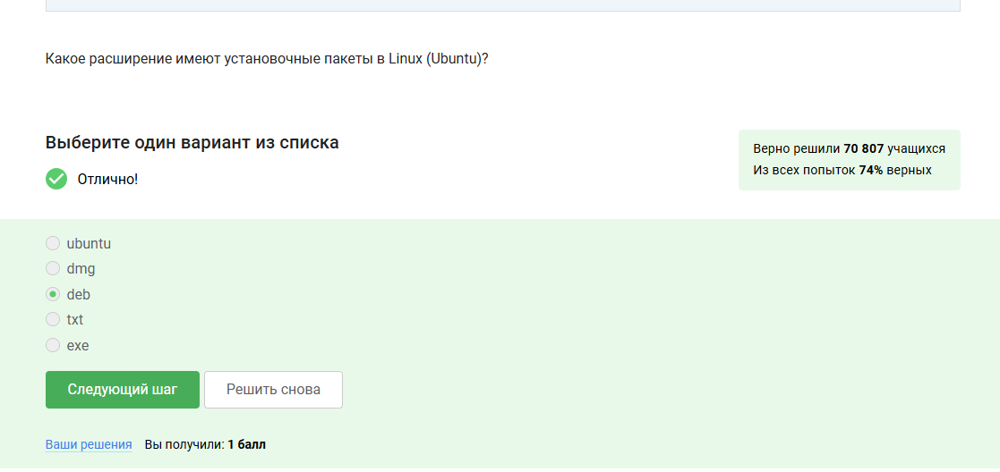{#fig:006 width=70%}

7. Просто открыть справку. На первом месте человек с такой интересной двойной фамилией.(рис. [-@fig:007]).

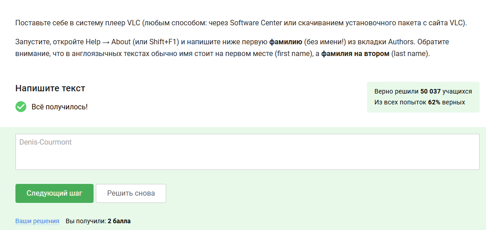{#fig:007 width=70%}

8. Опять вопрос, на который не нужно давать объяснение. Другие варианты просто не подходят.(рис. [-@fig:008]).

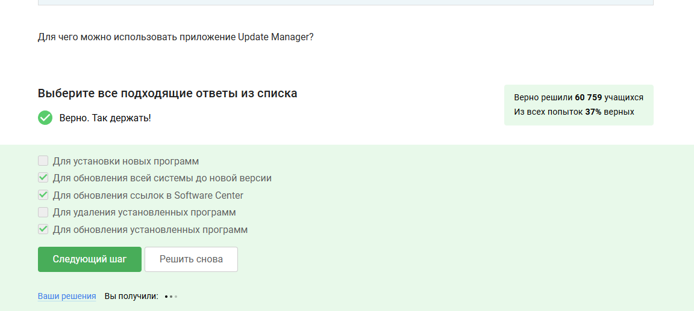{#fig:008 width=70%}

9. Терминал и консоль. Всё остальное - абсурд.(рис. [-@fig:009]).

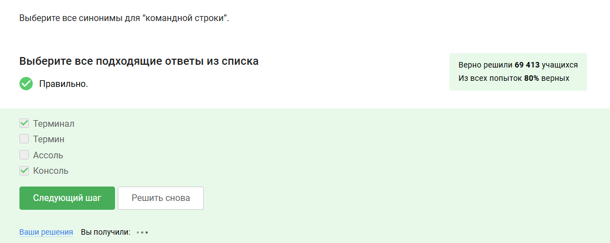{#fig:009 width=70%}

10. pwd т.к. linux чувствителен к регистру команд.(рис. [-@fig:010]).

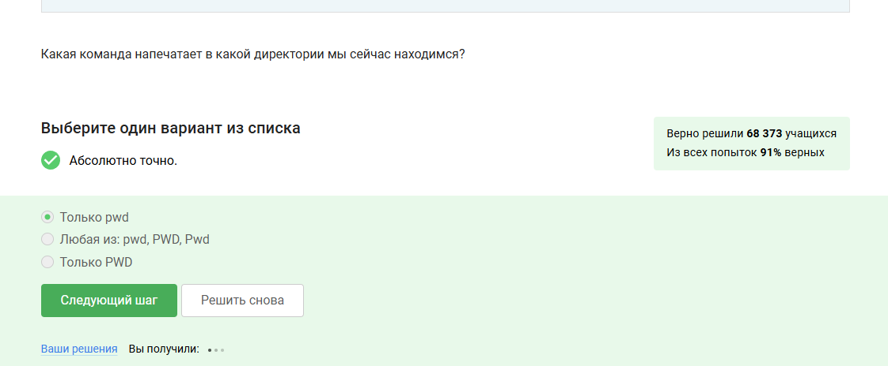{#fig:010 width=70%}

11. ls -A --human-readable -l /some/directory
Это означает:

-A: показывать все файлы, кроме . и ..
--human-readable: отображать размеры файлов в удобочитаемом виде
-l: длинный формат вывода
/some/directory: каталог для просмотра
Теперь проверим каждую из предложенных команд:

ls -h -A -l /some/directory
Здесь используются те же опции, только -h вместо --human-readable.
Эквивалентна исходной команде.

ls -lAh /some/directory
Опции: -l, A, h — порядок не важен, все опции присутствуют.
Эквивалентна исходной команде.

ls --human-readable -A  -l /some/directory
Опции: --human-readable, -A, -l.
Эквивалентна исходной команде.

ls -Ahl /some/directory
Опции: -A, h, l.
Эквивалентна исходной команде.

Итак, все четыре варианта полностью эквивалентны исходной команде.(рис. [-@fig:011]).

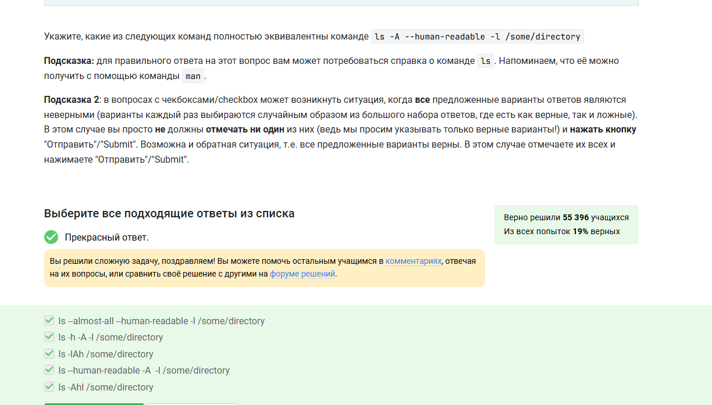{#fig:011 width=70%}

12. Рассмотрим каждую команду и определим, какая из них выведет содержимое /home/bi/Downloads, не показывая содержимое других директорий:

ls ./../Downloads

./ — текущая директория (/home/bi/Documents)
./.. — родительская директория (/home/bi)
./../Downloads — путь к /home/bi/Downloads
Эта команда выведет содержимое /home/bi/Downloads.

ls /home/bi/Do*

Расширение Do* совпадёт с любыми файлами или папками, начинающимися на Do в /home/bi.
В данном случае, скорее всего, совпадёт с /home/bi/Downloads.
Если в /home/bi есть только папка Downloads, команда выведет её содержимое.
Но если есть другие файлы или папки, начинающиеся на Do, она выведет их тоже. Поэтому эта команда не гарантированно выводит только /home/bi/Downloads.

ls ../Downloads

Относительный путь: из текущей директории (/home/bi/Documents) — один уровень вверх (..) — /home/bi, затем Downloads.
Выведет содержимое /home/bi/Downloads.

ls ~/Downloads

Тильда (~) — домашняя директория пользователя (/home/bi).
Выведет содержимое /home/bi/Downloads.

Итог:

Команды 1, 3 и 4 точно выведут содержимое /home/bi/Downloads.
Команда 2 может вывести содержимое других файлов или папок, начинающихся на Do, поэтому не гарантированно.(рис. [-@fig:012]).

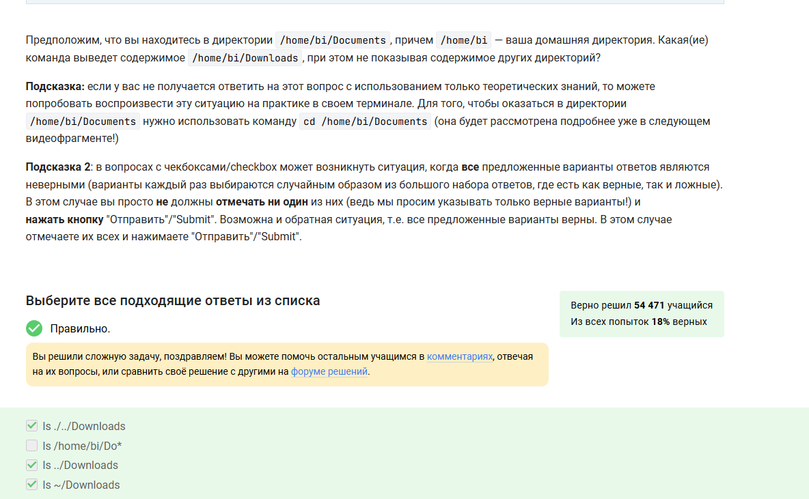{#fig:012 width=70%}

13. rm -r -- рекурсивное удаление(рис. [-@fig:013]).

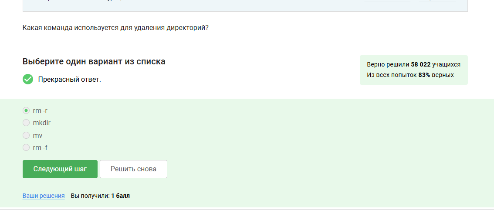{#fig:013 width=70%}

14. Firefox меншает закрытию терминала, если закроют firefox, терминал закроется следом(рис. [-@fig:014]).

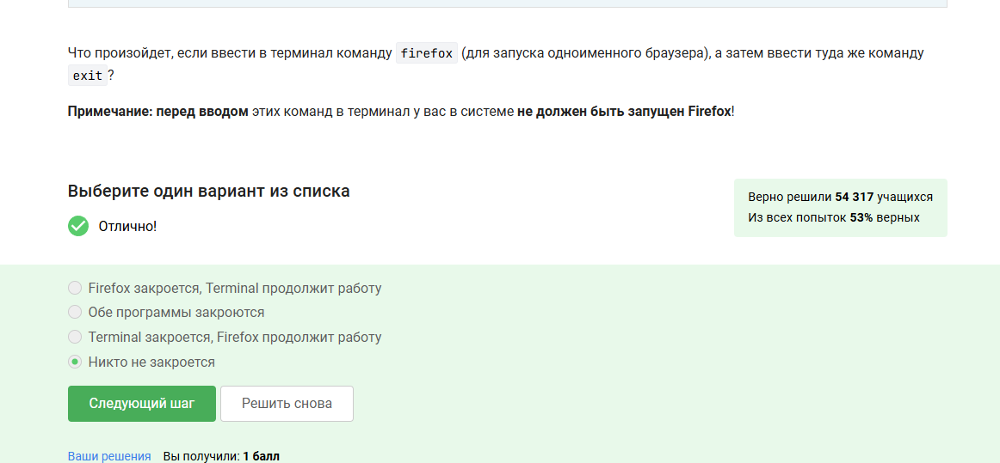{#fig:014 width=70%}

15. Теоретический вопрос. Ответ такой. И не может быть иным(рис. [-@fig:015]).

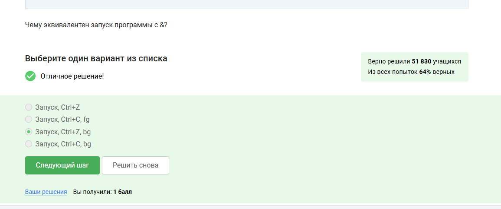{#fig:015 width=70%}

16. Выдаём права на исполнения файлу, запускаем через терминал, копируем вывод.(рис. [-@fig:016]).

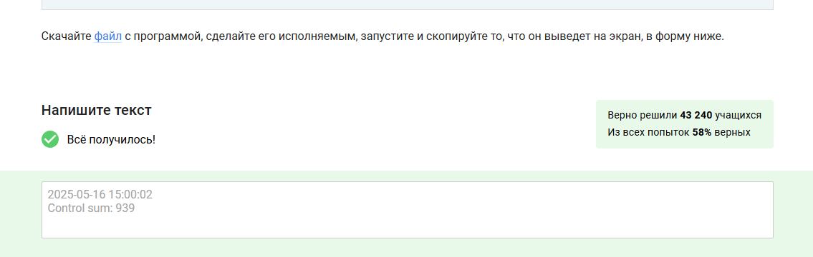{#fig:016 width=70%}

17. Лог выводится прямо на экран.(рис. [-@fig:017]).

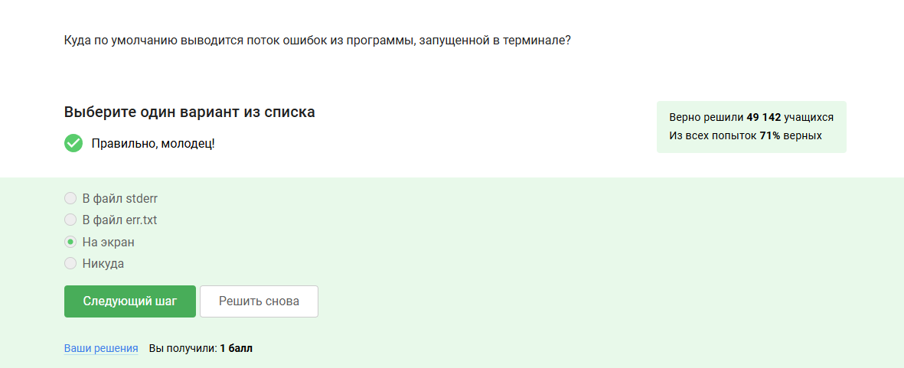{#fig:017 width=70%}

18. Рассмотрим каждую команду и определим, создаст ли она файл file.txt и запишет ли в него поток ошибок программы program.

program  file.txt .

Перенаправляет вход программы (stdin) из файла file.txt.
Не влияет на поток ошибок (stderr).
Не создаст или не запишет в file.txt поток ошибок.
Результат: не создаст файл file.txt для записи ошибок.
program 2> file.txt

Перенаправляет поток ошибок (stderr) в файл file.txt.
Если файла нет, он создастся.
Запишет поток ошибок в file.txt.
Результат: создаст файл file.txt и запишет туда поток ошибок.
program 2>> file.txt

Перенаправляет поток ошибок (stderr) в конец файла file.txt.
Если файла нет, он создастся.
Запишет поток ошибок в конец файла.
Результат: создаст файл file.txt, если его нет, и добавит поток ошибок.
program >> file.txt

Перенаправляет стандартный вывод (stdout) в конец файла file.txt.
Не влияет на поток ошибок (stderr).
Не запишет поток ошибок в файл.
Результат: не создаст или не запишет ошибочный поток.
program file.txt 2

Неправильная команда; 2 — некорректное перенаправление (обычно 2 — синтаксическая ошибка).
В любом случае, она не создает или не записывает поток ошибок в file.txt.
program >> file.txt

Использует here-document (ввод из строки), что не связано с созданием файла для потока ошибок.
Не создает или не записывает ошибочный поток в файл.(рис. [-@fig:018]).

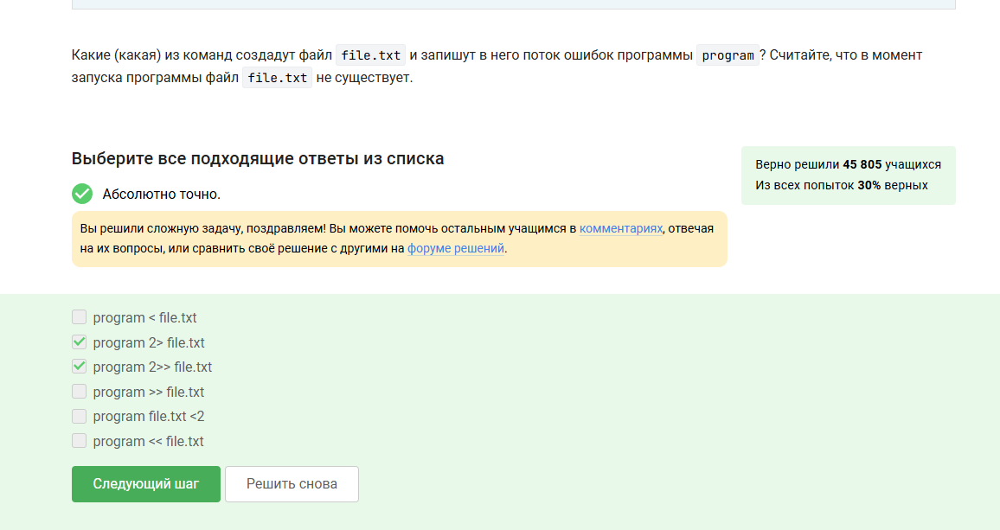{#fig:018 width=70%}

19. Аналогично с заданием 17(рис. [-@fig:019]).

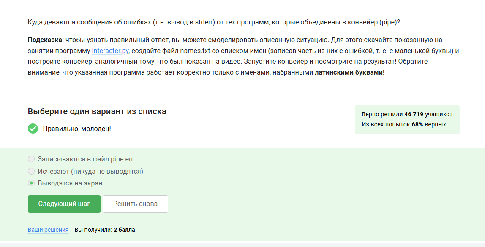{#fig:019 width=70%}

20. Т.к. было изменено имя файла, файл сохранился в текущем каталоге (/home/alex)(рис. [-@fig:020]).

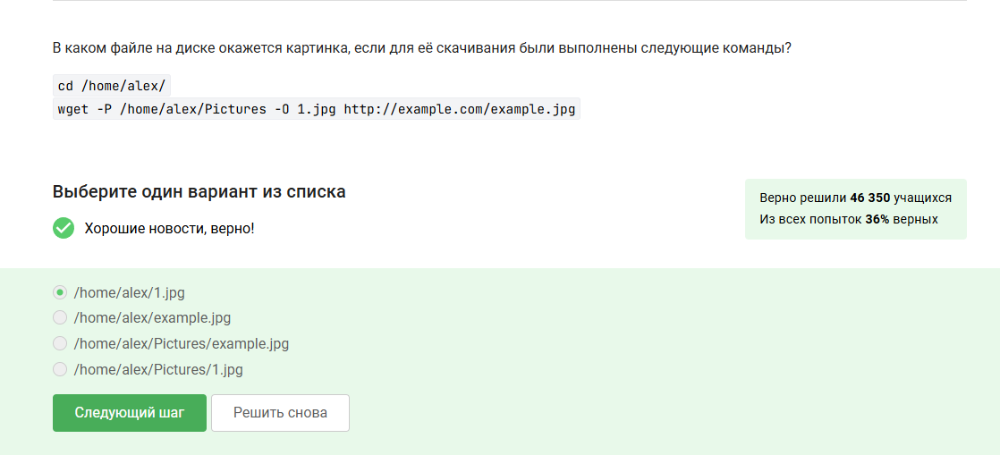{#fig:020 width=70%}

21. Теоретический вопрос(рис. [-@fig:021]).

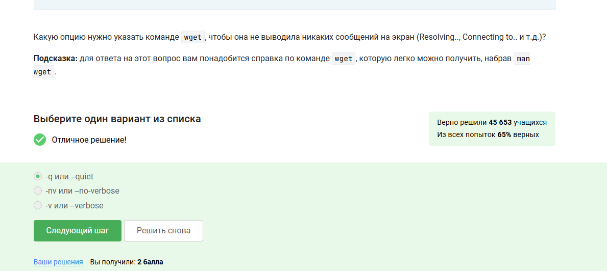{#fig:021 width=70%}

22. html нужны как временные файлы, чтоб рекурсивно на них искать другие jpg(рис. [-@fig:022]).

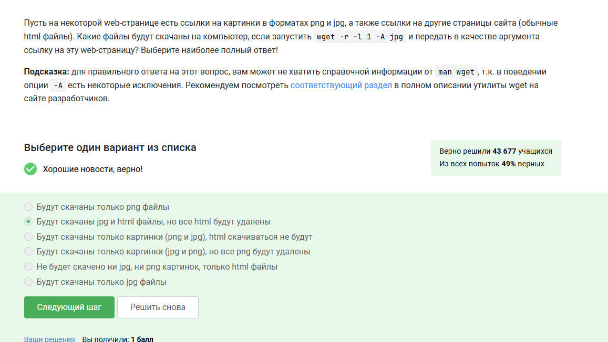{#fig:022 width=70%}

23. Специфика работы программ, теоретический вопрос(рис. [-@fig:023]).

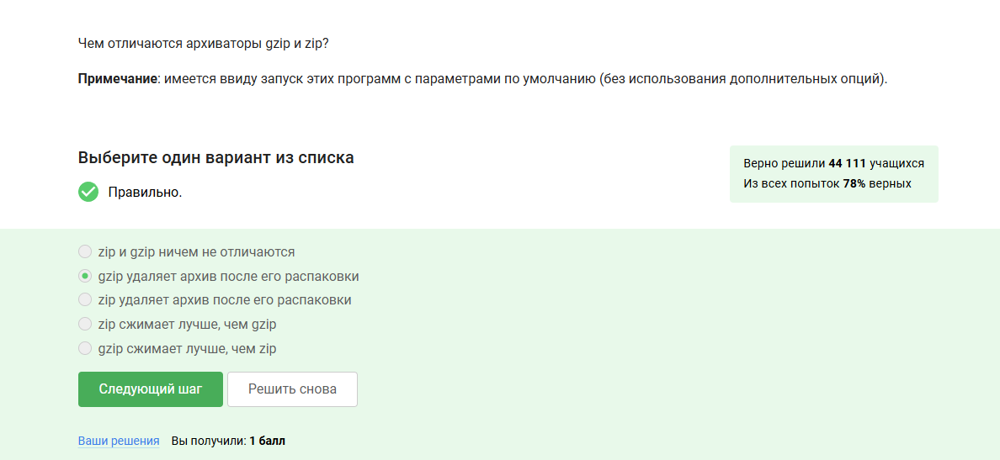{#fig:023 width=70%}

24. Теоретический вопрос(рис. [-@fig:024]).

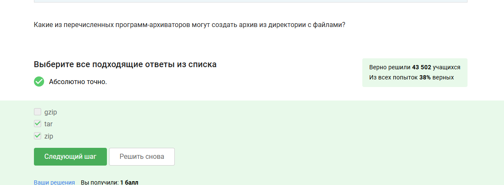{#fig:024 width=70%}

25. -c — создать новый архив
-j — использовать сжатие bzip2
-f — указать имя файла архива(рис. [-@fig:025]).

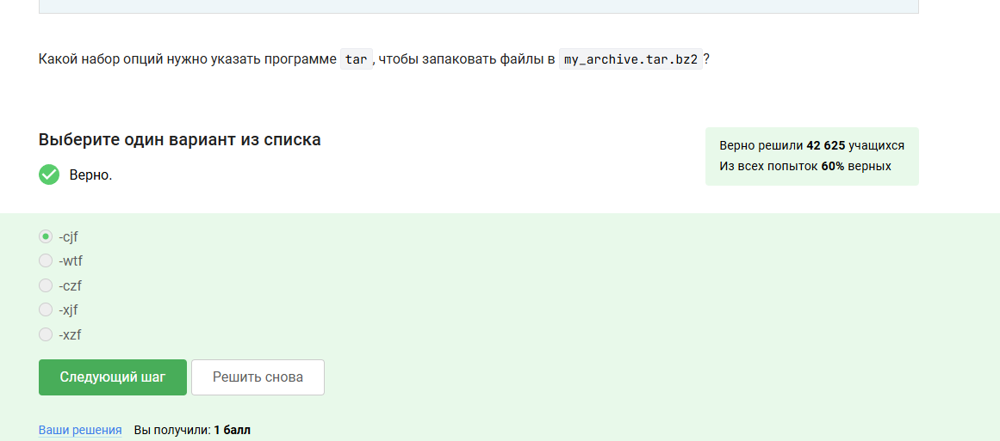{#fig:025 width=70%}

26. Маски, которые НЕ найдут файл Alexey.jpeg:
*.? (расширение из одного символа)
*.jpg (расширение .jpg)
alexey.* (начинается на alexey.)(рис. [-@fig:026]).

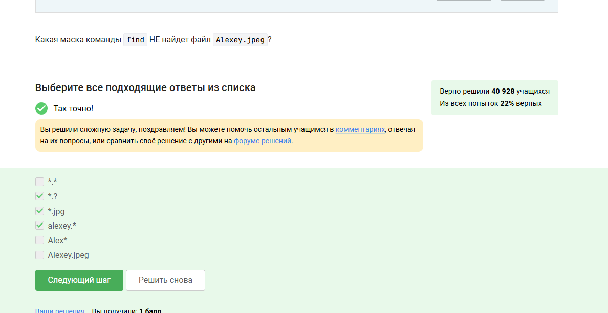{#fig:026 width=70%}

27. Команда grep "world" text.txt ищет строки, содержащие последовательность символов world в точности так, как указано, с учетом регистра (чувствительна к регистру).

Рассмотрим каждую строку:

The word is not enough

содержит word, а не world — не совпадает.
The World Is Not Enough

содержит World с заглавной буквы — не совпадает, так как поиск чувствителен к регистру.
The beautiful-world is not enough

содержит -world, но не  world — не совпадает.
The "world" is not enough

содержит "world" внутри кавычек, но именно world — есть, и оно в точности так — совпадает.
world

полностью совпадает — совпадает.
World

с заглавной буквы — не совпадает (чувствительно к регистру).
The world is not enough

содержит world — совпадает.
The beautifulworld is not enough

содержит beautifulworld, а не отдельное слово world. В строке есть часть слова, но grep ищет подстроку, поэтому она найдется — совпадает.
(рис. [-@fig:027]).

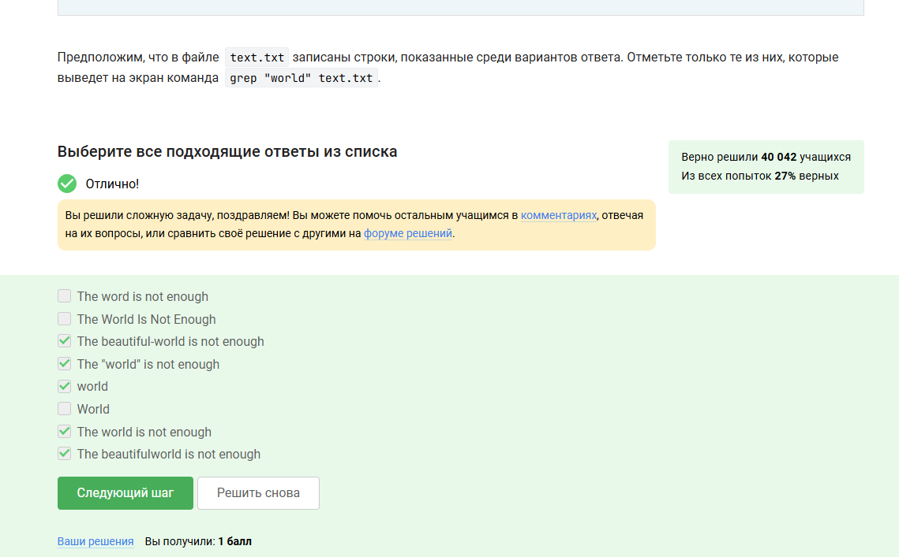{#fig:027 width=70%}

28. grep -Fr "love" Shakespeare/* > ~/rezult.txt(рис. [-@fig:028]).

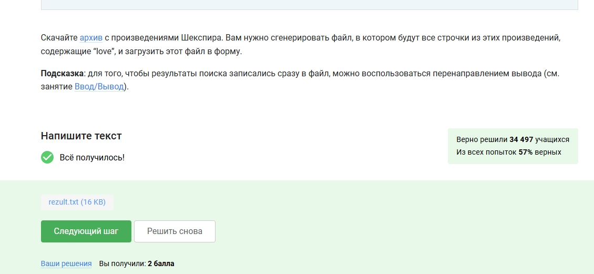{#fig:028 width=70%}

# Выводы

Были получены знания о Линуксе: терминале, командам, их работе, архиваторам. Были выполнены тесты.

