---
## Front matter
title: "Отчёт по прохождению внешнего курса"
subtitle: "2 этап"
author: "Ярослав Антонович Меркулов"

## Generic otions
lang: ru-RU
toc-title: "Содержание"

## Bibliography
bibliography: bib/cite.bib
csl: pandoc/csl/gost-r-7-0-5-2008-numeric.csl

## Pdf output format
toc: true # Table of contents
toc-depth: 2
lof: true # List of figures
fontsize: 12pt
linestretch: 1.5
papersize: a4
documentclass: scrreprt
## I18n polyglossia
polyglossia-lang:
  name: russian
  options:
	- spelling=modern
	- babelshorthands=true
polyglossia-otherlangs:
  name: english
## I18n babel
babel-lang: russian
babel-otherlangs: english
## Fonts
mainfont: IBM Plex Serif
romanfont: IBM Plex Serif
sansfont: IBM Plex Sans
monofont: IBM Plex Mono
mathfont: STIX Two Math
mainfontoptions: Ligatures=Common,Ligatures=TeX,Scale=0.94
romanfontoptions: Ligatures=Common,Ligatures=TeX,Scale=0.94
sansfontoptions: Ligatures=Common,Ligatures=TeX,Scale=MatchLowercase,Scale=0.94
monofontoptions: Scale=MatchLowercase,Scale=0.94,FakeStretch=0.9
mathfontoptions:
## Biblatex
biblatex: true
biblio-style: "gost-numeric"
biblatexoptions:
  - parentracker=true
  - backend=biber
  - hyperref=auto
  - language=auto
  - autolang=other*
  - citestyle=gost-numeric
## Pandoc-crossref LaTeX customization
figureTitle: "Рис."
tableTitle: "Таблица"
listingTitle: "Листинг"
lofTitle: "Список иллюстраций"
lotTitle: "Список таблиц"
lolTitle: "Листинги"
## Misc options
indent: true
header-includes:
  - \usepackage{indentfirst}
  - \usepackage{float} # keep figures where there are in the text
  - \floatplacement{figure}{H} # keep figures where there are in the text
---

# Цель работы

Пройти второй этап внешнего курса "Введение в Linux".

# Выполнение этапа

1. Все варианты подходят, теоретический вопрос (рис. [-@fig:001]).

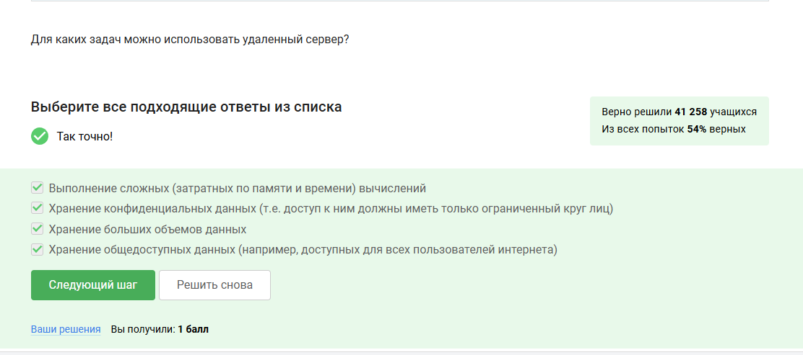{#fig:001 width=70%}

2. Ключ, который можно безопасно пересылать по интернету, — это файл id_rsa.pub.
Это публичный ключ, его предназначение — обмениваться с серверами или другими пользователями для установления доверия.

Файл id_rsa — приватный ключ, его нельзя передавать или показывать другим, чтобы не скомпрометировать безопасность вашей системы.(рис. [-@fig:002]).

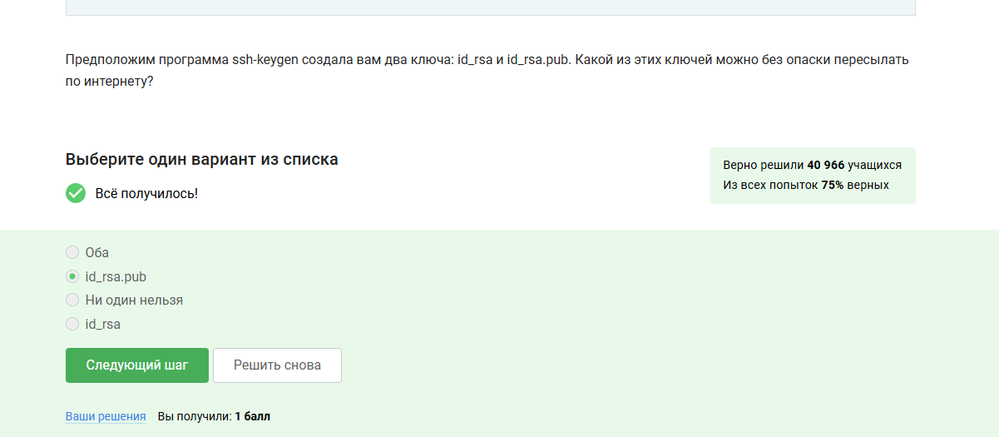{#fig:002 width=70%}

3. -r — рекурсивное копирование, необходимо для папок и их содержимого.
stepic — имя папки, которую нужно скопировать.
username@server:~/ — целевая директория на сервере (домашняя директория пользователя).(рис. [-@fig:003]).

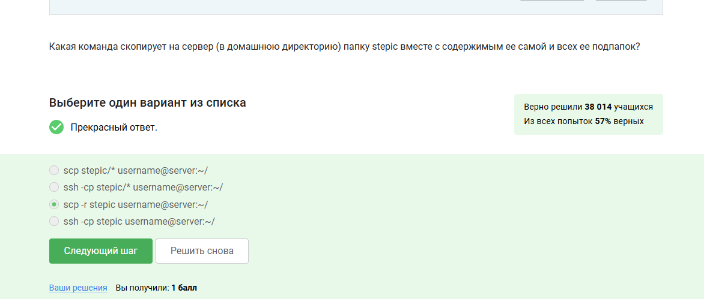{#fig:003 width=70%}

4. sudo apt-get update

Объяснение:

Эта команда обновляет список доступных пакетов и их версий из репозиториев.
После её выполнения система узнает о последних версиях пакетов и сможет найти нужный вам пакет program. (рис. [-@fig:004]).

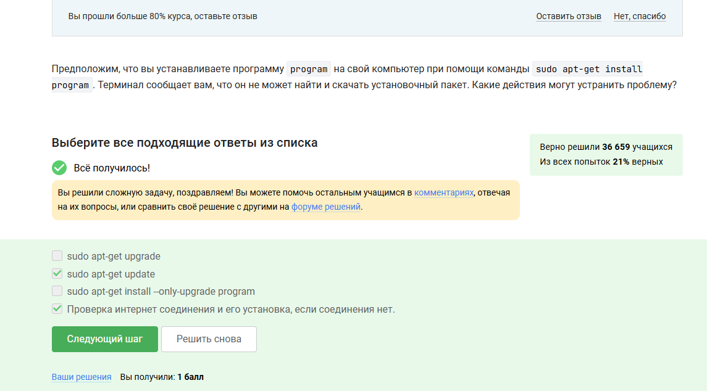{#fig:004 width=70%}

5. Filezilla можно использовать для всех названных действий, исключая запуск программ на сервере(рис. [-@fig:005]).

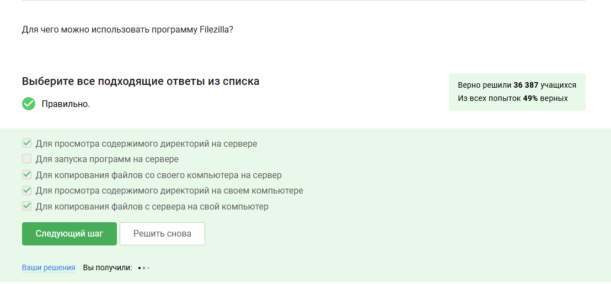{#fig:005 width=70%}

6. Теоретический вопрос(рис. [-@fig:006]).

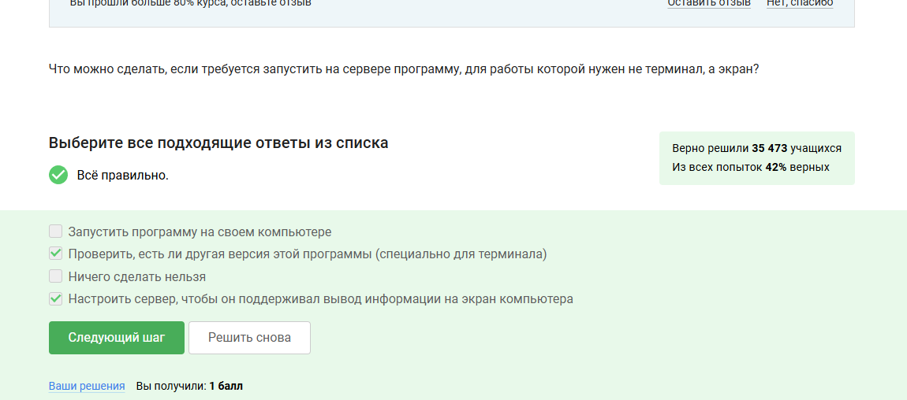{#fig:006 width=70%}

7. Теоретический вопрос. program ?! не является вызовом справки.(рис. [-@fig:007]).

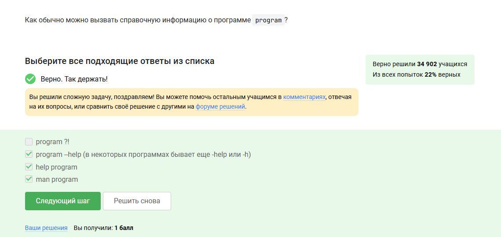{#fig:007 width=70%}

8. bam,sam,bam_mapped,sam_mapped and fastq (форматы, которые поддерживаются)(рис. [-@fig:008]).

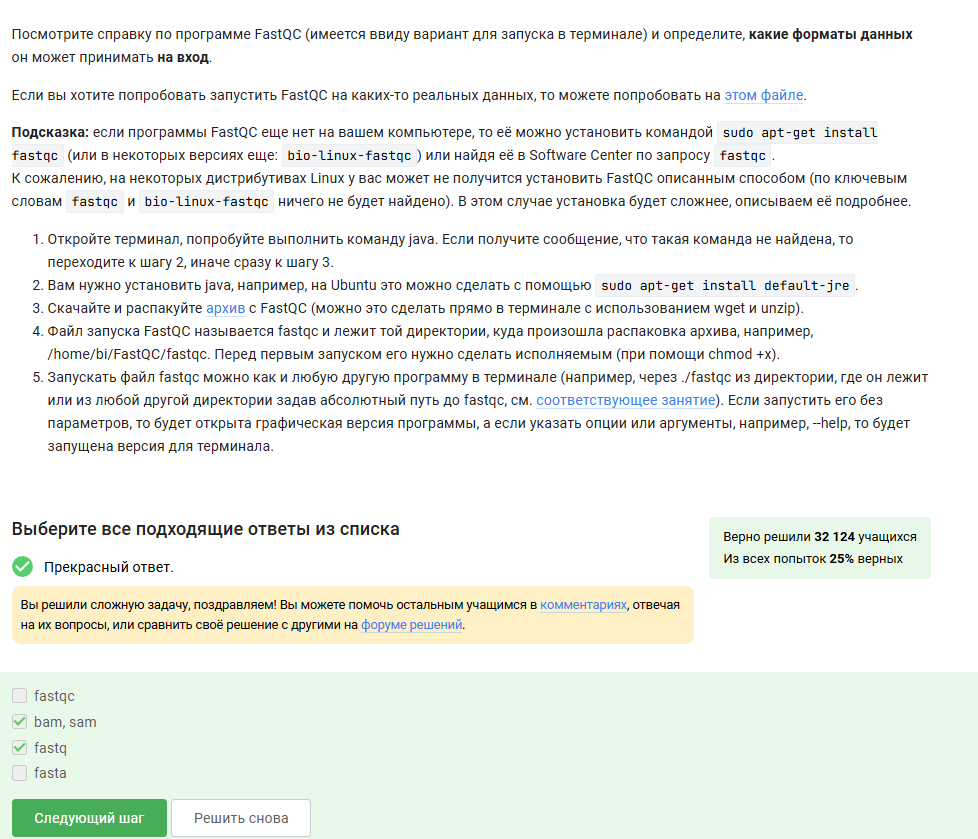{#fig:008 width=70%}

9. Читаем справку и вводим нужную команду(рис. [-@fig:009]).

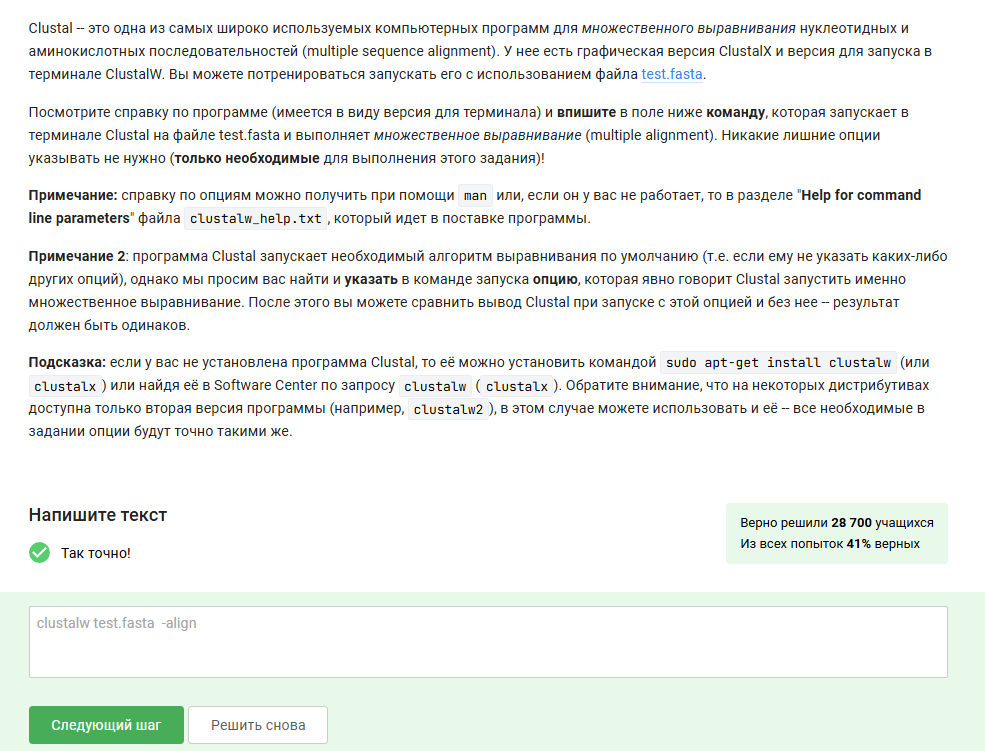{#fig:009 width=70%}

10. Давайте разберёмся по шагам, что произошло:

Вы запустили program1, program2 и program3 в фоновом режиме — скорее всего, командой с &, например:

program1 &  # запущен в фонеprogram2 &  # запущен в фонеprogram3 &  # запущен в фоне
Выполнили fg %1 — переводим на передний план (фронт-энд) программу, которая была запущена как job №1 (предположим, это program1).
Нажали Ctrl+C — послали сигнал прерывания текущей программы (program1), она завершилась.
Выполнили fg %2 — снова переводим на передний план программу №2 (program2).
Нажали Ctrl+Z — приостановили выполнение программы №2 (program2) (она переходит в состояние "заморожена" или "остановлена").
Выполнили команду jobs.
Что показывает команда jobs?
Она выводит список текущих задач (jobs), которые находятся в состоянии "запущены в фоне" или "приостановлены".

После всех действий:

program1 завершилась (после Ctrl+C) — она исчезла из списка jobs.
program2 была приостановлена (Ctrl+Z) — она всё ещё есть в списке jobs.
program3, который был запущен ранее и не был тронут, всё ещё работает в фоне.
Итог:
В списке jobs будут отображены только те программы, которые ещё активны или приостановлены, то есть:

program2 (приостановлена)
program3 (в фоновом режиме)(рис. [-@fig:010]).

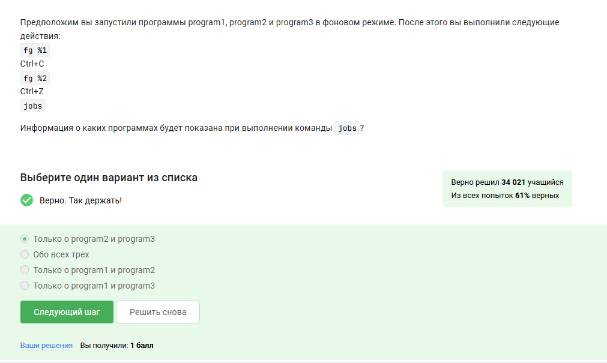{#fig:010 width=70%}

11. Теоретический вопрос(рис. [-@fig:011]).

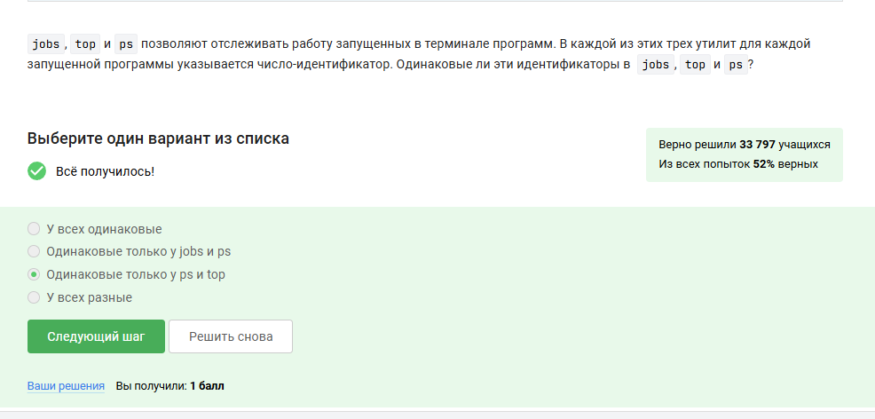{#fig:011 width=70%}

12. kill -9 — принудительно завершает процесс без возможности обработки сигнала.(рис. [-@fig:012]).

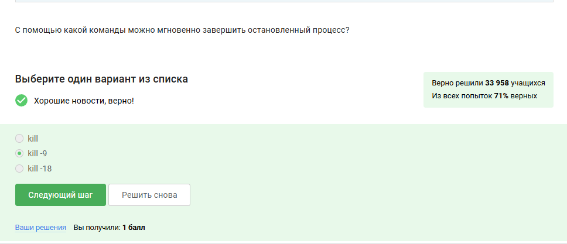{#fig:012 width=70%}

13. Сначала процесс надо продолжить, только после этого он будет завершен(рис. [-@fig:013]).

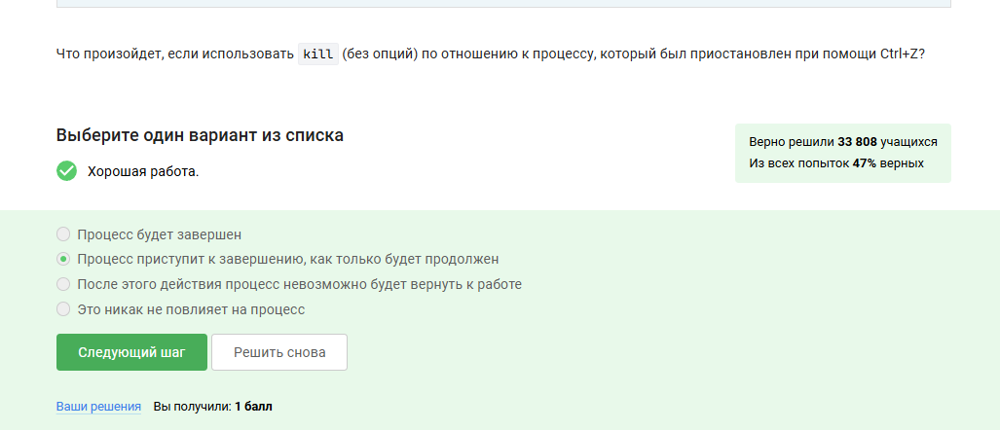{#fig:013 width=70%}

14. Когда процесс или поток приостанавливается (сигналом SIGSTOP или через Ctrl+Z), он переходит в состояние "заморожен" (stopped).
В этом состоянии он не выполняется и не занимает процессорное время.
Поэтому, в состоянии "приостановки", использование CPU для этого процесса равно 0%.(рис. [-@fig:014]).

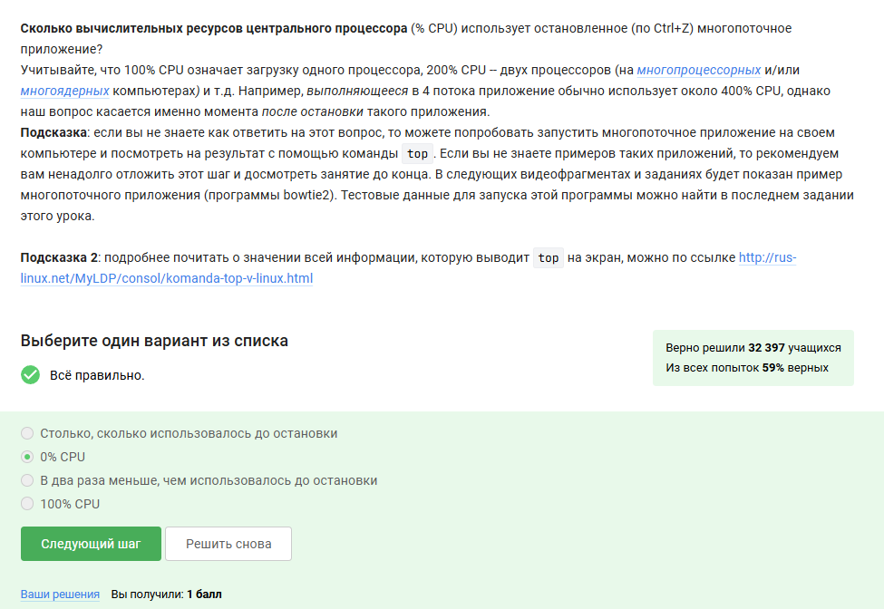{#fig:014 width=70%}

15. Приостановка процесса с помощью Ctrl+Z (после сигнала SIGSTOP) не освобождает и не уменьшает его использование памяти.
Процесс остается в памяти операционной системы, его ресурсы (включая память) сохраняются.
Единственное изменение — процесс переходит в состояние "остановлен" (stopped), но его память остается выделенной.(рис. [-@fig:015]).

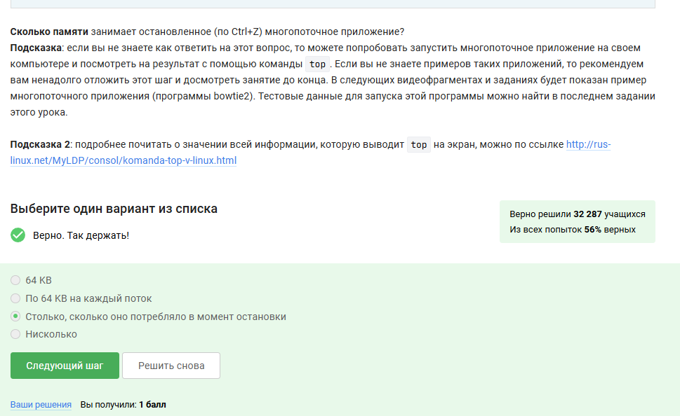{#fig:015 width=70%}

16. Нельзя завершить отдельный поток(рис. [-@fig:016]).

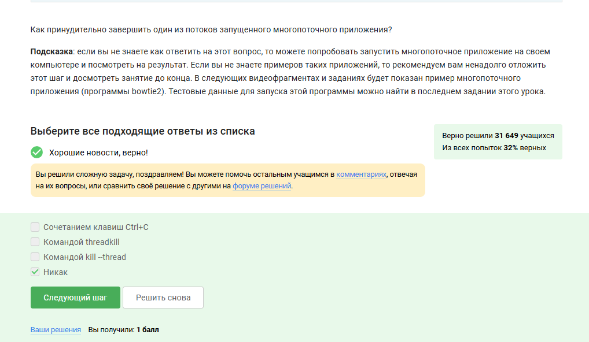{#fig:016 width=70%}

17. Теоретический вопрос(рис. [-@fig:017]).

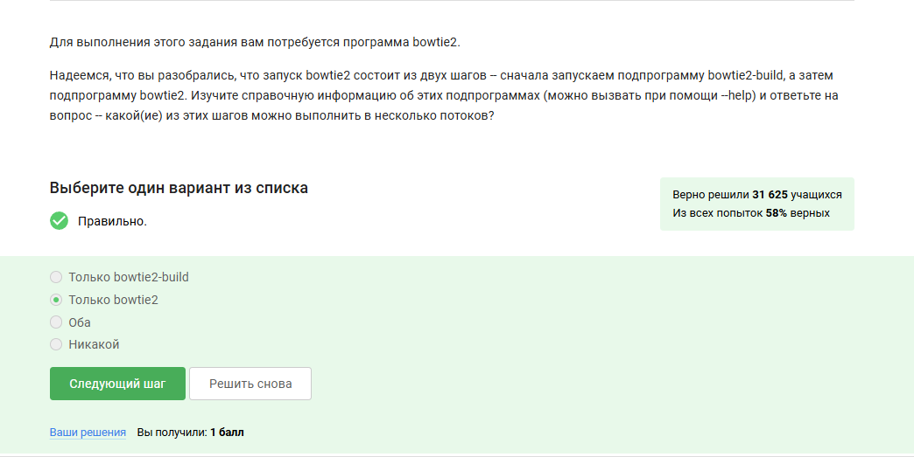{#fig:017 width=70%}

18. Работа в программе bowtie2

(рис. [-@fig:018]).

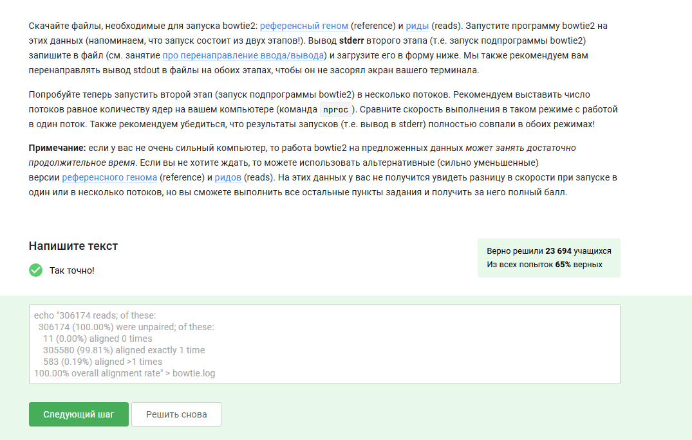{#fig:018 width=70%}

19. Теоретический вопрос(рис. [-@fig:019]).

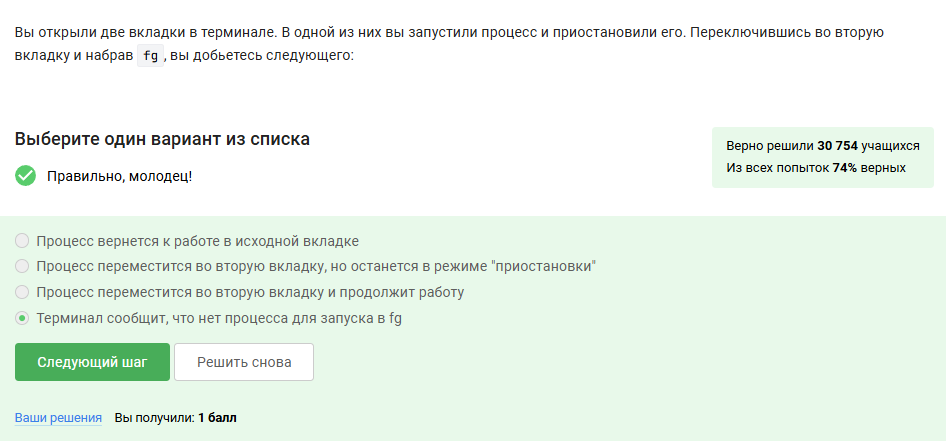{#fig:019 width=70%}

20. Теоретический вопрос(рис. [-@fig:020]).

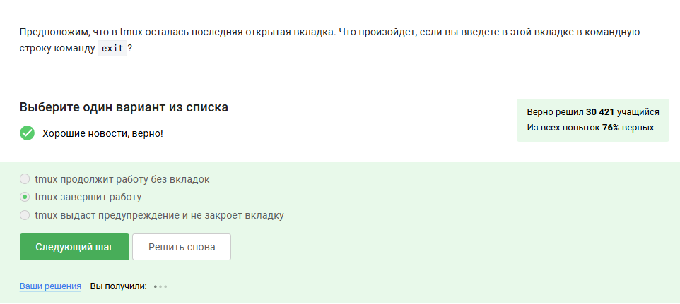{#fig:020 width=70%}

21. Закрытие терминала не закрывает tmux. Tmux продолжит работать в фоновом режиме.(рис. [-@fig:021]).

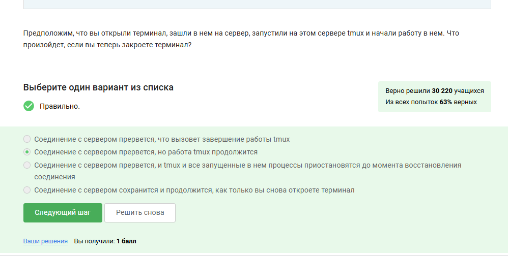{#fig:021 width=70%}

22. В tmux каждая вкладка (или окно) — это отдельная сессия терминала.
Когда вы закрываете вкладку (kill-window или через X), по умолчанию все процессы, запущенные внутри этой вкладки, получают сигнал завершения (SIGHUP или другой сигнал), и обычно завершаются.
Если процесс был запущен в фоновом режиме (например, с помощью &), он всё равно связан с текущей сессией окна и завершится при закрытии окна, если не был отделён.(рис. [-@fig:022]).

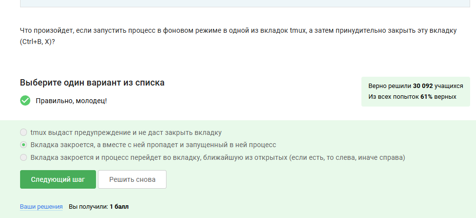{#fig:022 width=70%}

23. Теоретический вопрос(рис. [-@fig:023]).

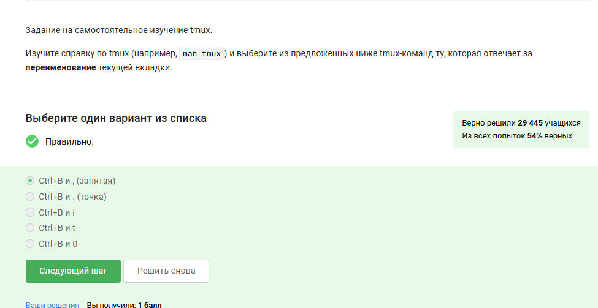{#fig:023 width=70%}

24. Много теоретический аспектов(рис. [-@fig:024]).

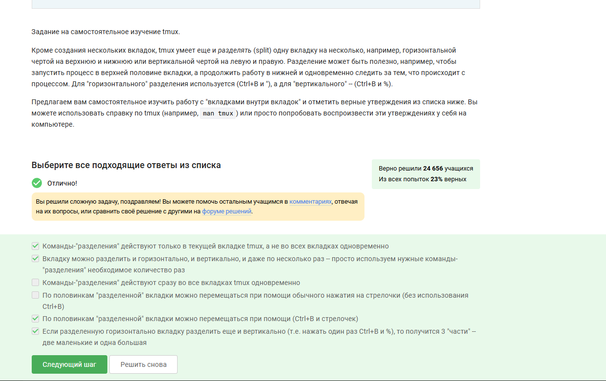{#fig:024 width=70%}

# Выводы

Были получены знания о Линуксе: серверах, запуске и работе приложений (bowtie2), потоках. Были выполнены тесты.

